# Journal de création

## Semaine 1

Au cours de cette semaine, nous avons acheté les différents éléments du décors. Nous avons donc acheté un piédestal et une horloge. Tristan a récupéré un téléphone à roulette chez lui. 

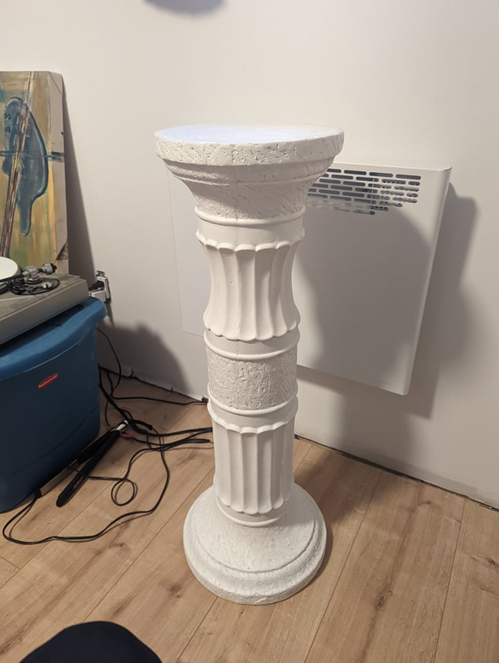

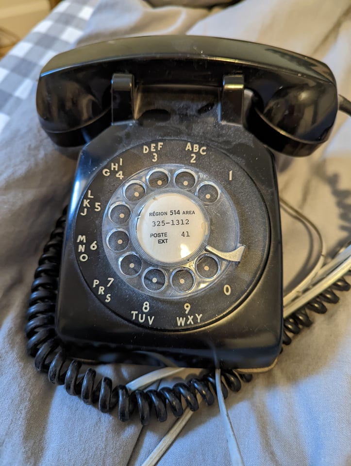

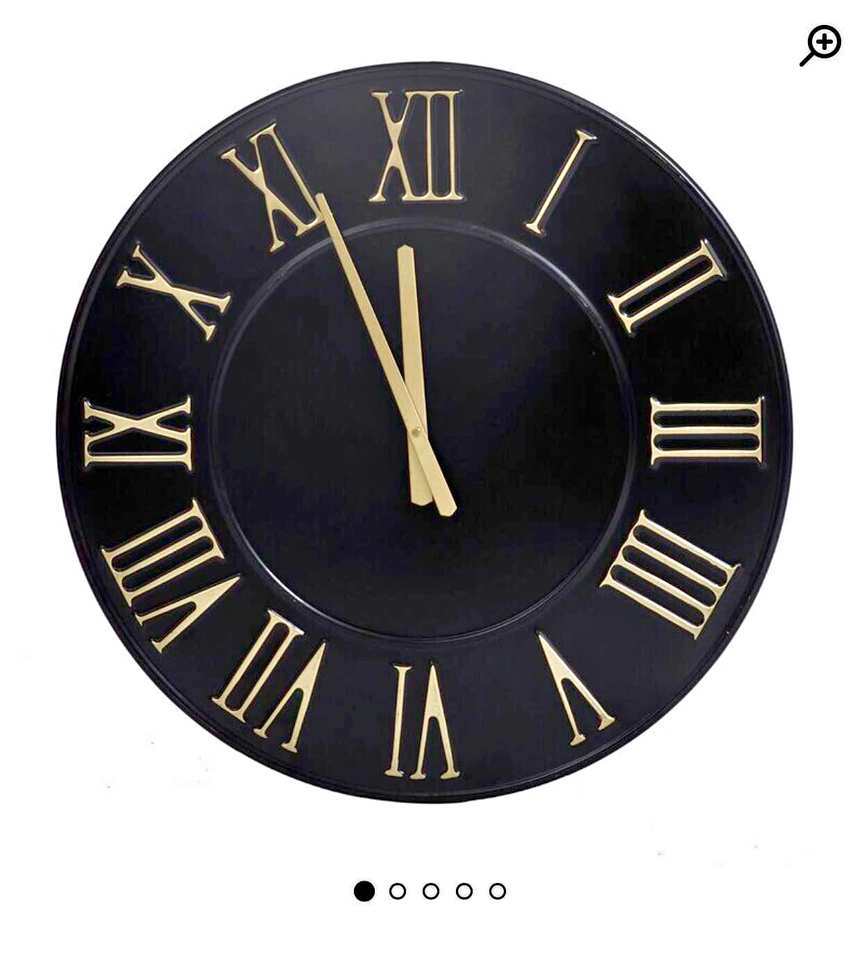

Ensuite, nous avons aussi concrétisé certains points de la préproduction.

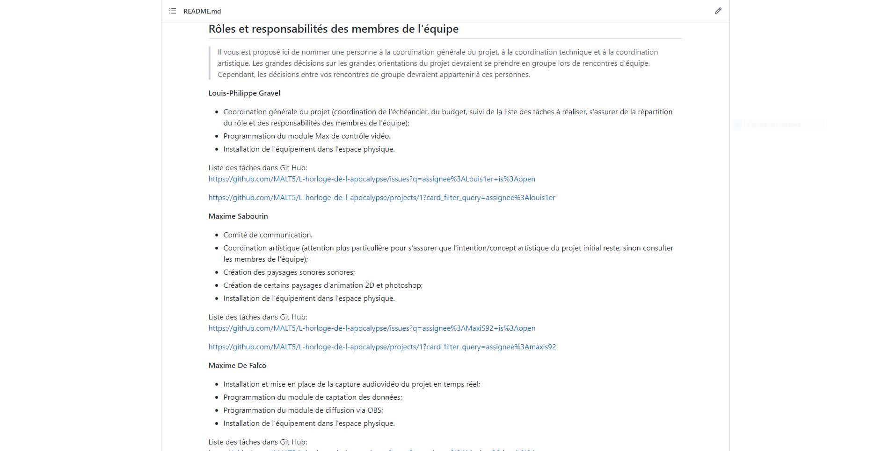

Pour finir, nous nous sommes aussi filmés pour réaliser la vidéo explicative de la préproduction pour pouvoir faire un montage.

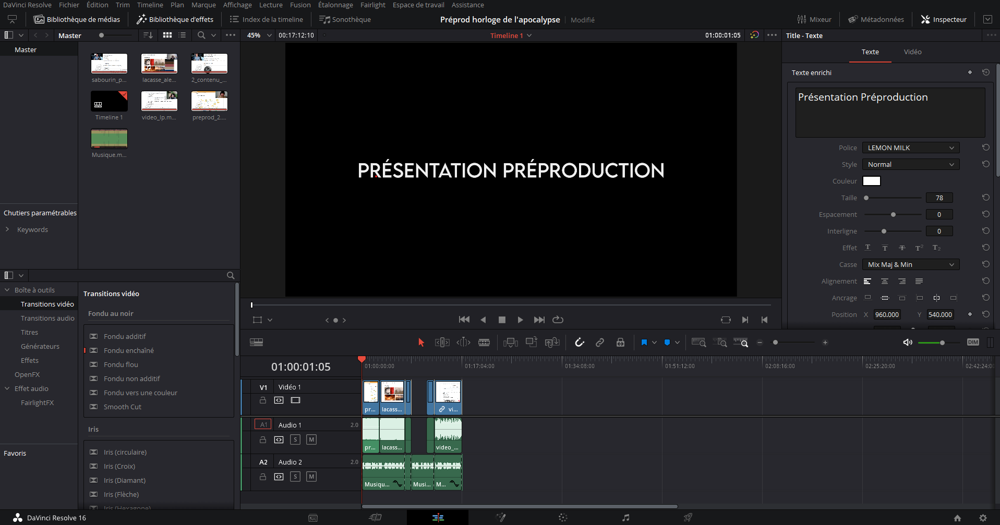

## Semaine 2

Au cours de cette semaine, nous avons réécrit le scénario pour guider notre production dans les semaines suivantes.

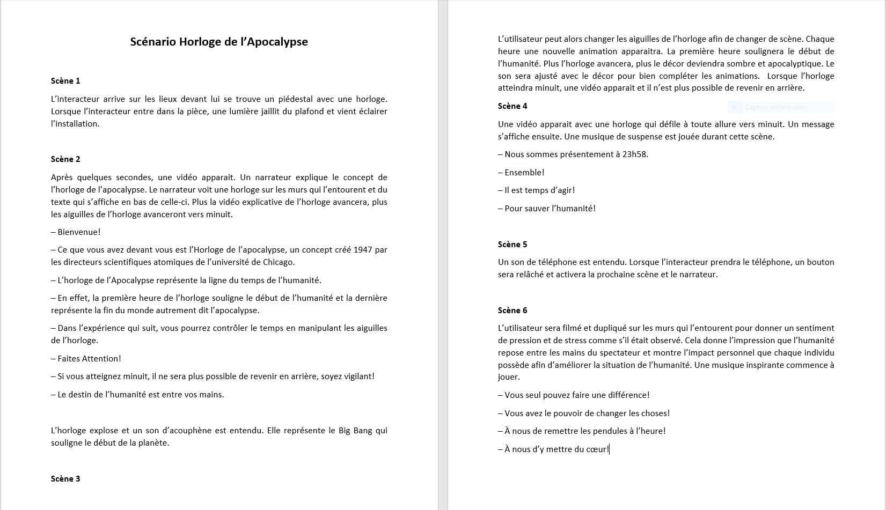

De plus, nous avons terminé le montage final de la vidéo de la présentation de la préproduction pour l'évaluation formative de mercredi.

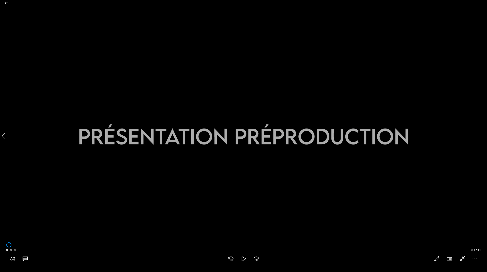

Nous avons aussi fait une redirection artistique au niveau des photoshop afin de les rendre plus simples et professionnels

Avant: 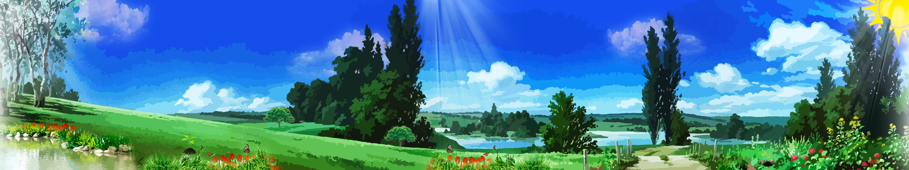

Après: 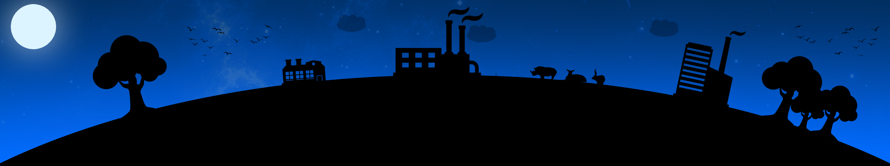

Nous avons aussi effectué des changements pour le schéma de branchement et plantation.

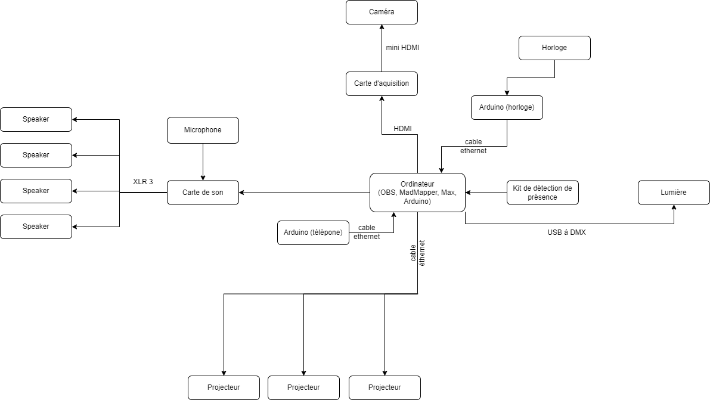

Pour finir, nous avons aussi améliorer l'arborescence de fichiers de nos médias des journaux pour mieux les séparer pour une meilleure organisation.

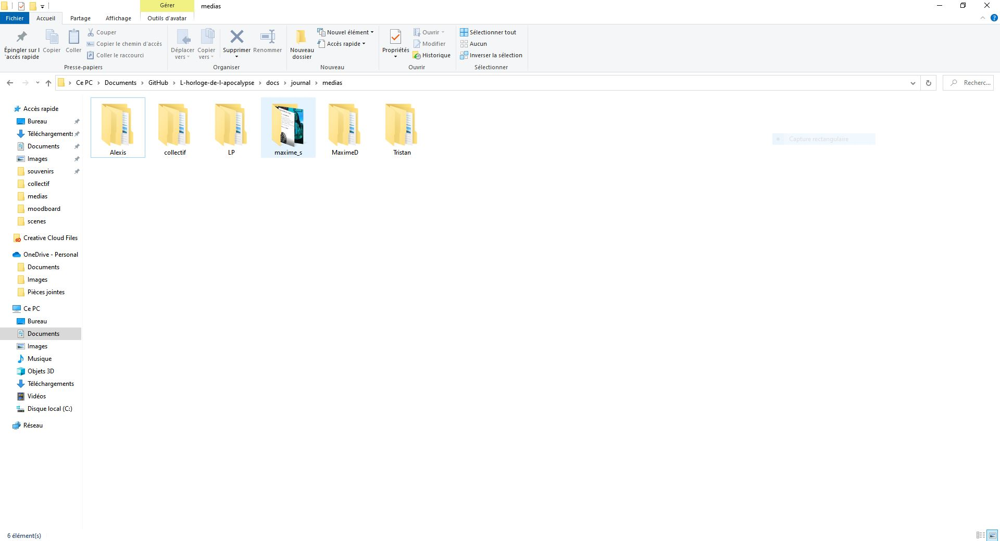

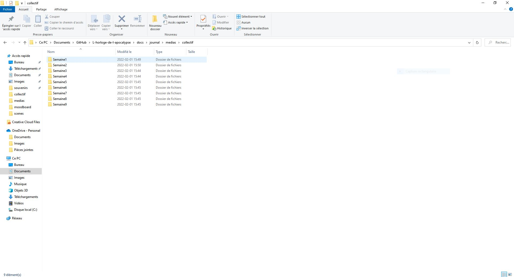

## Semaine 3

Au cours de cette semaine, nous avons amélioré le scénario afin de corriger certaines erreurs. Pour approndir, nous avons rajouté certains éléments afin de rendre l'histoire plus concise et mieux structurée. 

 
De plus, nous avons corrigé certains éléments de la préproduction dans le github :
- Les moodboards de chaque scène. 
- La mise en page du scénario.
- Style artistique des scènes (collage à vectoriel).
- Trouver une solution au problème du potentiomètre qui ne se remet pas au début de l'expérience.
- Amener l'équipement dans le petit studio et les placer dans l'espace physique.
- Avancement des scènes illustrator.
- Update de certains éléments sur le site web.

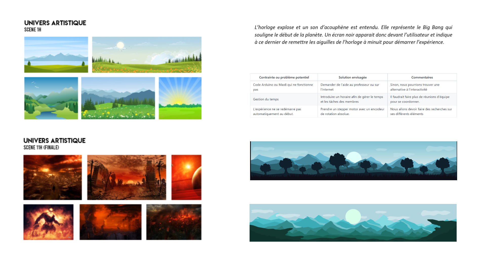
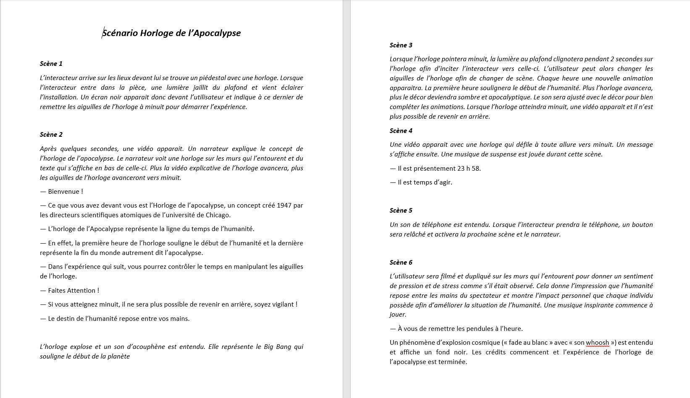

Nous avons aussi reeffectué notre vidéo explicative de la préproduction pour corriger certaines erreurs et rendre le tout beaucoup plus concis.   

## Semaine 4

Au cours de cette semaine, nous avons corrigé les éléments finaux de notre préproduction. Nous avons ajouté des contraintes potentielles du projet, avons fait des moodboards sonore et amélioré certaines planches Photoshop. 

De plus, nous avons apporté certaines modification à notre code Max de départ puisque nous avions changé certains élémens du scénario dans notre pré-production. Nous avons aussi ajouter des scènes OBS afin de bien suivre le scénario. 

Nous avons aussi commencé à installer certains éléments dans studio afin de tester notre projection et le son. Nous avons installé les trois projecteurs ainsi que les haut-parleurs. Plusieurs autres objets ont été ajouté aux petit studio comme un barre pour avancer les projecteurs. Aussi, la pluspart du matériel requis est maintenant acquis.

## Semaine 9
> Contenu personnalisé à remplir par les équipes à chaque semaine faisant part du processus de création: résumé des réalisations d'équipe effectuées et des défis rencontrés sous forme d'un texte; ajout de vidéos, images, documents audios ou de contenu multimédia.)

Cette semaine a été parsemée de défis.

Tout d’abord, comme prévu, nous avons terminé de créer nos images dans Photoshop et le contenu 3D dans Maya. Nous avons également avancé la programmation multimédia du projet dans le logiciel Max et Unity.

Par la suite, nous avions prévu une séance d’enregistrement audio dans les studios de son. Cependant, misère (!), une panne d’électricité a eu lieu durant notre séance! Nous avons donc dû remettre celle-ci à quelques jours plus tard. (Nous avons beaucoup ri de cette situation.)

Enfin, nous venons de commencer à mettre en espace le projet dans le grand studio du collège. Nos projecteurs viennent tout juste d’être installés! 

On a bien hâte de voir le projet se concrétiser davantage dans les lieux physiques. À suivre

## Semaine 8

## Semaine 7

## Semaine 6

## Semaine 5

