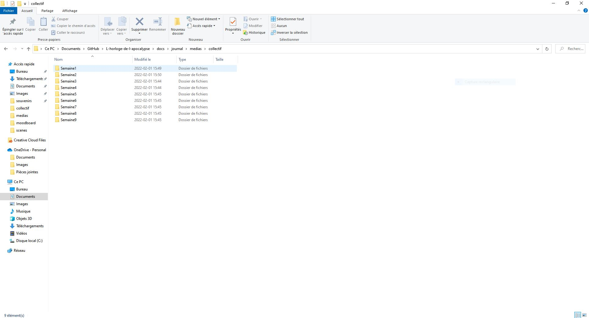
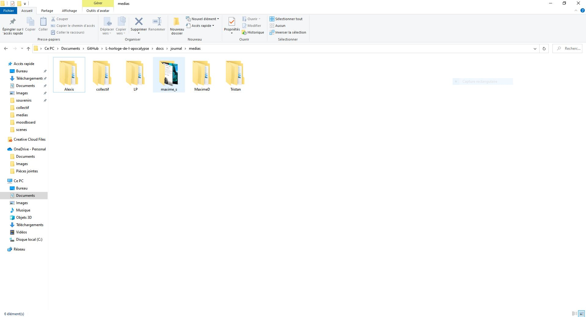
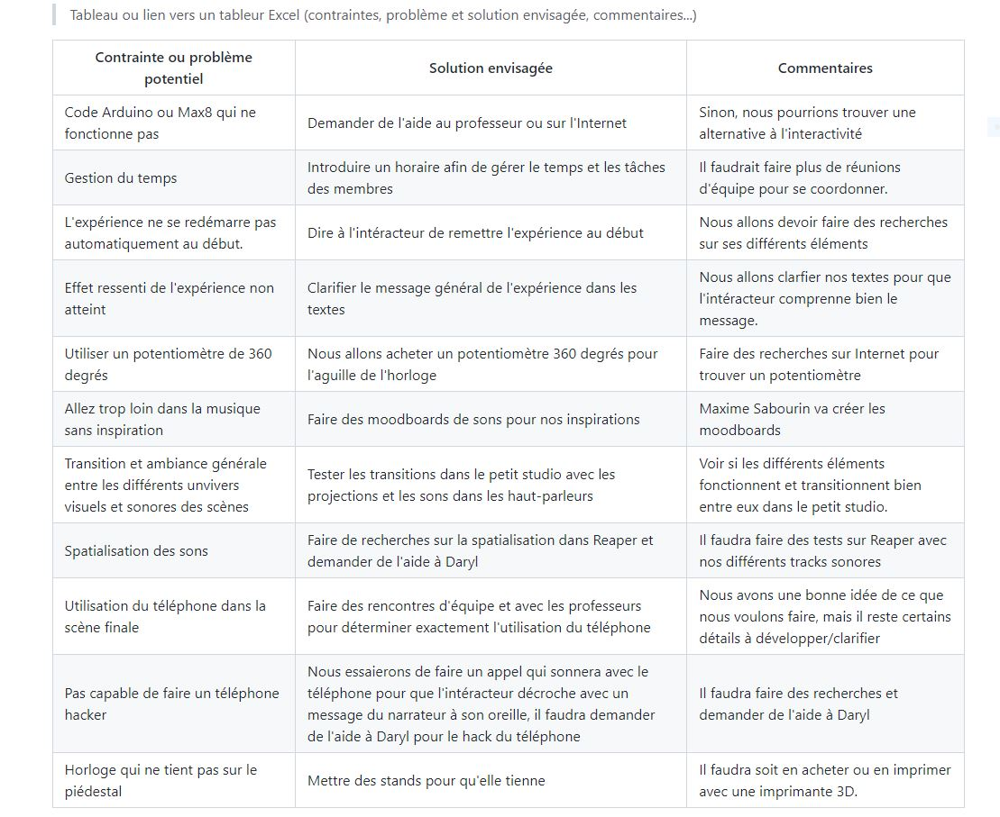
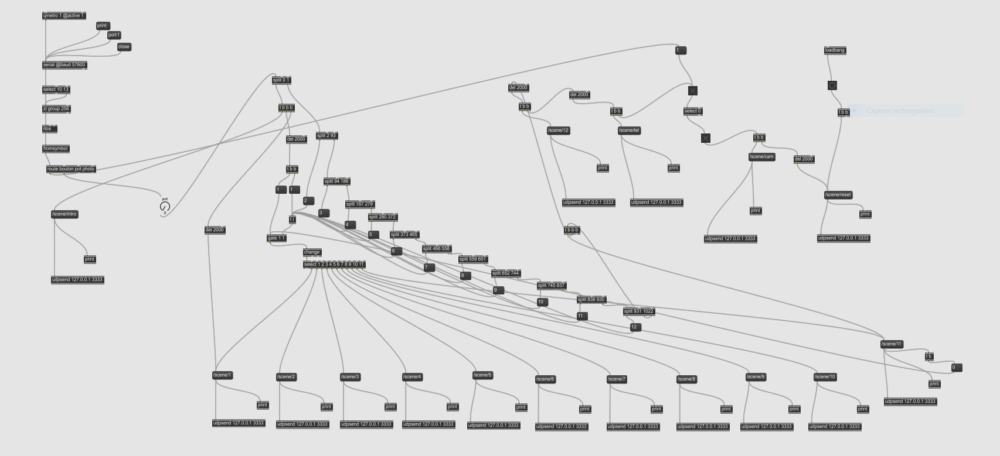
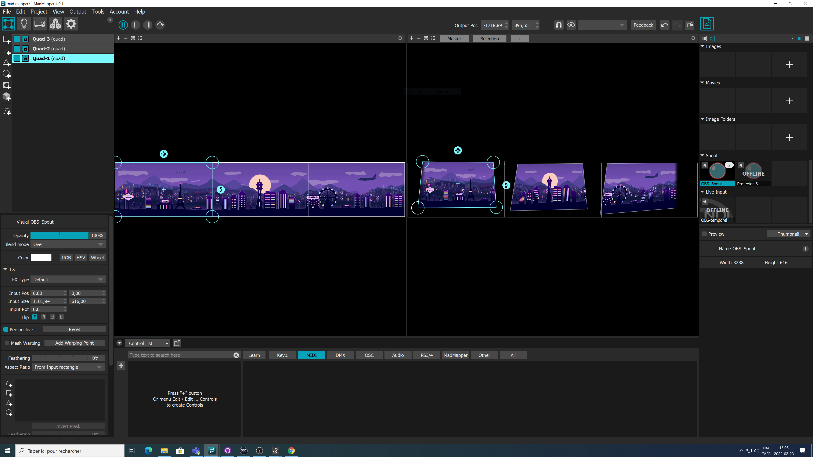
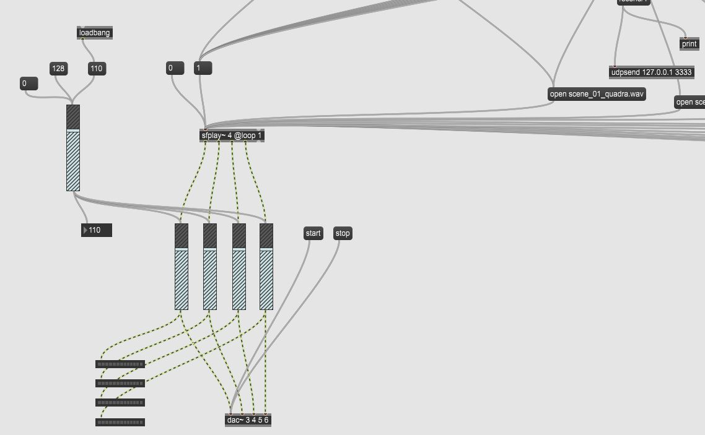
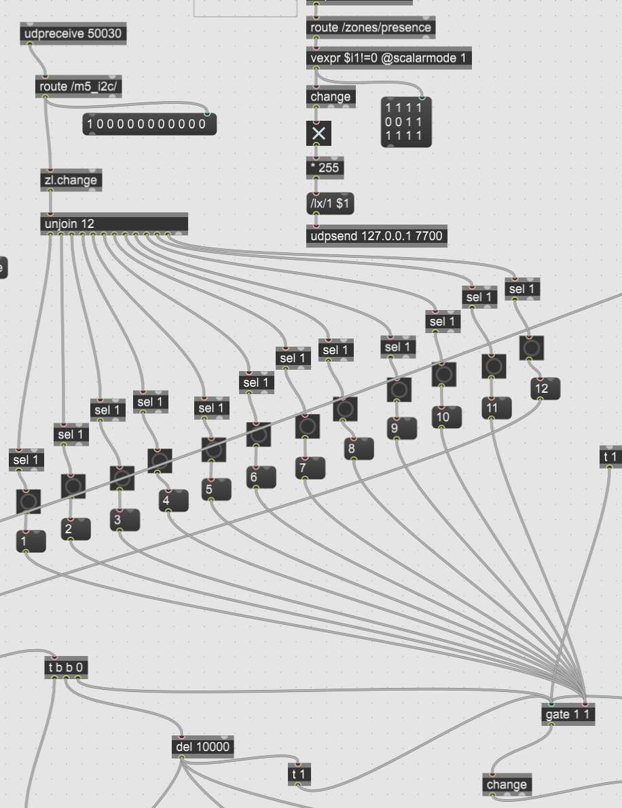
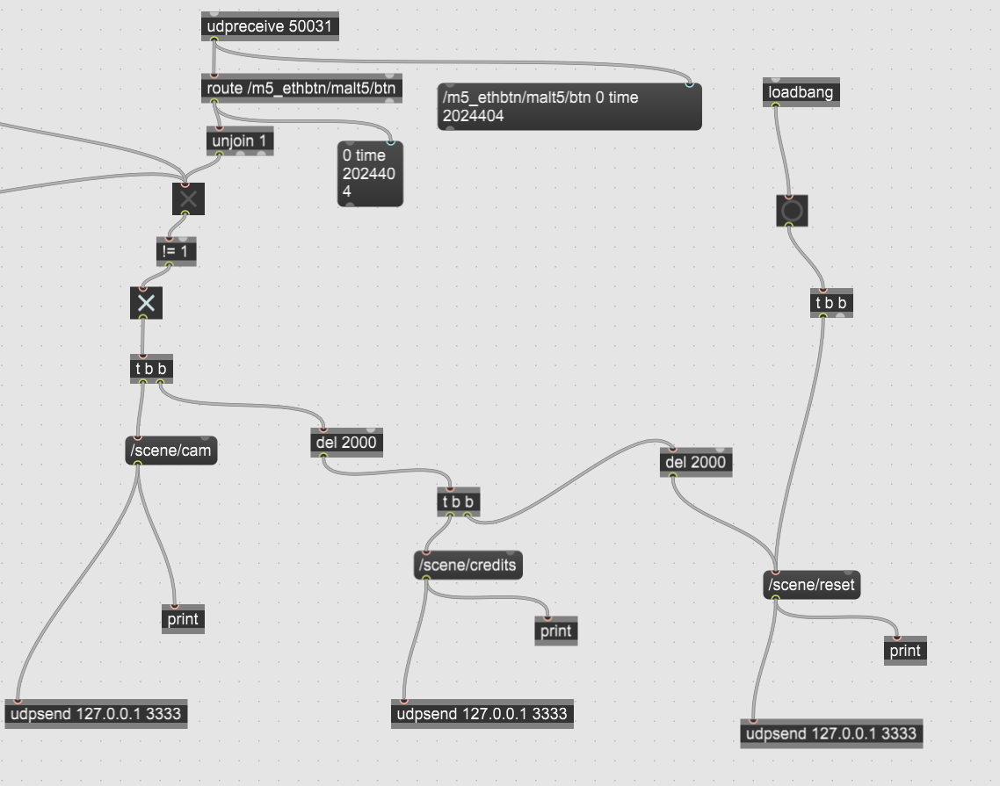
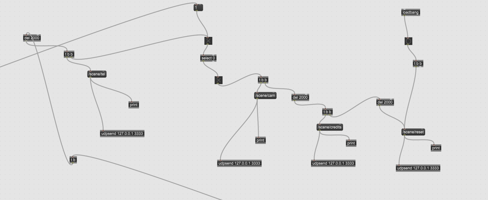

# Journal de Louis-Philippe Gravel

* [Semaine 1](#semaine-1)
* [Semaine 2](#semaine-2)
* [Semaine 3](#semaine-3)
* [Semaine 4](#semaine-4)
* [Semaine 5](#semaine-5)
* [Semaine de rattrapage](#semaine-de-rattrapage)
* [Semaine 6](#semaine-6)
* [Semaine 7](#semaine-7)
* [Semaine 8](#semaine-8)
* [Semaine 9](#semaine-9)

## Semaine 1

### Résumé des réalisations effectuées
- Amélioration de l'arborescence du projet
- Préparation de la vidéo de présentationn de la préproduction
- Début du journal
- Préciser certains points de la préproduction pour la vidéo
- Séparation des parties de la préprod pour la présentation 
- Titre du projet en français

### Image d'une réalisation dont tu es la ou le plus fier

### Est-ce que j'ai accompli l'ensemble des tâches et objectifs que je m'étais fixés pour cette semaine?	
- [x] Complètement
- [ ] Assez
- [ ] Peu
- [ ] Pas du tout

#### Décrivez pourquoi.
Nous nous sommes pris d'avance et avons réaliser toutes les tâches d'équipes et individuelles de la semaine

#### S'il y a lieu, qu'allez-vous faire pour remédier à la situation?
N/A

### Mon projet s'est-il réalisé selon l’échéancier prévu?

- [x] Complètement
- [ ] Assez
- [ ] Un peu
- [ ] Pas tout à fait

#### S'il y a des écarts, décrivez-les.
N/A

#### S'il y a lieu, qu'allez-vous faire pour remédier à la situation?
N/A

### Défis pour la prochaine semaine
Réaliser toutes les vidéos et le montage pour l'évaluation formative de la semaine prochaine et regarder le github pour préciser certaines tâches.

---
## Semaine 2
### Résumé des réalisations effectuées
- Nous avons clarifié le scénario
- Meilleure arborescence pour les médias des journaux
- Rencontre avec les professeurs
- Amélioration de la préproduction
- Ajout de la contrainte de l'expérience qui ne se rénitialise pas automatiquement

### Image d'une réalisation dont tu es la ou le plus fier

### Est-ce que j'ai accompli l'ensemble des tâches et objectifs que je m'étais fixés pour cette semaine?

- [x] Complètement
- [ ] Assez
- [ ] Peu
- [ ] Pas du tout

#### Décrivez pourquoi.
J'ai bien réaliser mes tâches et je me suis assuré de la bonne communication par rapport aux changements que nous voulions faire sur le projet dans la préproduction. J'ai aussi pris des notes sur les commentaires des professeurs sur les changements de la préproduction et sur les problèmes liés au projet.

#### S'il y a lieu, qu'allez-vous faire pour remédier à la situation?
N/A

### Mon projet s'est-il réalisé selon l’échéancier prévu?

- [x] Complètement
- [ ] Assez
- [ ] Un peu
- [ ] Pas tout à fait

#### S'il y a des écarts, décrivez-les.
N/A

#### S'il y a lieu, qu'allez-vous faire pour remédier à la situation?
N/A

### Défis pour la prochaine semaine
Refaire la vidéo de la préproduction pour diminuer la longueur pour qu'elle ne dépasse pas 10 min. Il faudra aussi aussi encore travailler sur la préproduction pour clarifier la conclusion avec le téléphone. Pour finir, il faudra faire des recherches sur la contrainte de l'expérience qui ne se rénitialise pas automatiquement.

---
## Semaine 3 
### Résumé des réalisations effectuées
- Écriture et recherches sur les contraintes du projet.
- Recherche sur le problème de l'expérience qui ne revient pas au début sans intéraction humaine.
- Refaire ma partie de la vidéo présentative de la préproduction.
- Travailler sur plusieurs parties de la préproduction pour l'améliorer.
- Organisation d'une journée (mardi prochain) pour prototyper l'ambiance générale de l'expérience (transitions entre les scènes, apparence visuelle des scènes et des sons/musique pour voir si le tous les éléments vont bien ensemble).

### Image d'une réalisation dont tu es la ou le plus fier

### Est-ce que j'ai accompli l'ensemble des tâches et objectifs que je m'étais fixés pour cette semaine?

- [x] Complètement
- [ ] Assez
- [ ] Peu
- [ ] Pas du tout

#### Décrivez pourquoi.
 J'ai bien réaliser mes tâches et j'ai pu coordonner une rencontre mardi prochain pour prototyper l'ambiance générale du projet. J'ai beaucoup développé les contraintes et les problèmes potentiels de l'expérience. J'ai encore améliorer certains points de la préproduction qui est devenue une bien meilleure version que la précédente. 

#### S'il y a lieu, qu'allez-vous faire pour remédier à la situation?
N/A

### Mon projet s'est-il réalisé selon l’échéancier prévu?

- [x] Complètement
- [ ] Assez
- [ ] Un peu
- [ ] Pas tout à fait

#### S'il y a des écarts, décrivez-les.
J'ai possiblement attraper le covid. Je ne vais donc probablement pas pouvoir me présenter mardi durant la rencontre que mon équipe et moi avons organisé.

#### S'il y a lieu, qu'allez-vous faire pour remédier à la situation?
Mes coéquipiers vont se rendre à l'école mardi et je serai en vidéo-conférence sur un appareil pour pouvoir participer à la rencontre et pouvoir aider à distance pour donner mon avis sur l'ambiance générale de l'expérience.

### Défis pour la prochaine semaine
Il faudra s'assurer de respecter les nouvelles modifications dans la préproduction. Je commencerai aussi à mettre à jour le code Max pour qu'il respecte le nouvel ordre des scènes que nous avons établi dans le scénario. Je vais aussi devoir regarder attentivement mon état par rapport au covid pour voir si je pourrai me présenter à l'école ou non à notre rencontre d'équipe mardi et à la journée de mercredi ou de vendredi.

---
## Semaine 4
### Résumé des réalisations effectuées
- J'ai réalisé le code Max avec Guillaume pour que le code suive le nouveau schéma scénaristique, on a fait un gate pour que l'intéracteur remette l'expérience à 0 au début.
- J'ai assister à la rencontre de mes coéquipiers à distance.
- J'ai complété les splits dans le code max pour qu'il aille le bon nombre de scènes OBS.
- J'ai assisté à la rencontre de mercredi à distance

### Image d'une réalisation dont tu es la ou le plus fier

### Est-ce que j'ai accompli l'ensemble des tâches et objectifs que je m'étais fixés pour cette semaine?

- [ ] Complètement
- [x] Assez
- [ ] Peu
- [ ] Pas du tout

#### Décrivez pourquoi.
 J'ai attrappé le covid, alors je n'ai pas eu assez d'énergie pour travailler sur le projet autant que je l'aurais voulu. 

#### S'il y a lieu, qu'allez-vous faire pour remédier à la situation?
Je vais essayer de travailler le plus possible sur le projet dans les prochains jours lorsque je me sentirai mieux.

### Mon projet s'est-il réalisé selon l’échéancier prévu?

- [ ] Complètement
- [x] Assez
- [ ] Un peu
- [ ] Pas tout à fait

#### S'il y a des écarts, décrivez-les.
Le covid ne m'a vraiment pas aidé pour mes travaux autant au niveau de la coordination de l'équipe qu'au niveau de mes tâches.

#### S'il y a lieu, qu'allez-vous faire pour remédier à la situation?
Mes symptômes ont un peu baissés alors je pourrai plus facilement travailler avec mon équipe. Je vais essayer de faire mes tâches correctement dans le temps imparti.

### Défis pour la prochaine semaine
Guérir du covid et commencer à mettre en relation le code Max avec OBS. Essayer de ne pas perdre trop d'informations par rapport à ce qui se passe dans nos installations dans le petit studio.

---
## Semaine 5
### Résumé des réalisations effectuées
- J'ai réalisé une partie du mapping des projecteurs dans Madmapper.
- J'ai aidé à placer les projecteurs pour que les projections affiche bien.
- J'ai connecté le Max8 au OBS avec OSC au Madmapper pour que les projections fonctionnent.
- Comprendre comment connecter le OBS à Madmapper avec Spout.
- Faire des recherches sur le potentiomètre 360 degrés avec Guillaume.

### Image d'une réalisation dont tu es la ou le plus fier

### Est-ce que j'ai accompli l'ensemble des tâches et objectifs que je m'étais fixés pour cette semaine?

- [x] Complètement
- [ ] Assez
- [ ] Peu
- [ ] Pas du tout

#### Décrivez pourquoi.
 J'ai pu allé à l'école et travailler avec mon équipe pour le placement des éléments physiques dans le petit studio. Nous avons aussi connecté tous les logiciels nécessaires au bon fonctionnement des projections (OBS, Max8, Madmapper)

#### S'il y a lieu, qu'allez-vous faire pour remédier à la situation?
N/A

### Mon projet s'est-il réalisé selon l’échéancier prévu?

- [x] Complètement
- [ ] Assez
- [ ] Un peu
- [ ] Pas tout à fait

#### S'il y a des écarts, décrivez-les.
N/A

#### S'il y a lieu, qu'allez-vous faire pour remédier à la situation?
N/A

### Défis pour la prochaine semaine
Terminer de spatialiser le son dans les haut-parleurs en mettant les sons dans Max8 et placer le potentiomètre avec l'horloge pour vérifier son fonctionnement.

---
## Semaine de rattrapage
### Résumé des réalisations effectuées
- J'ai updaté et ajouté des issues de tâches que nous devrons faire pour le reste de la session.
- J'ai fait le code Max qui permettait de contrôler le son à partir de Max au lieu d'OBS
- J'ai aidé à faire sortir le son des haut-parleurs en quadraphoniques à partir de Max.
- J'ai aidé à placer des éléments physiques dans le studio comme la caméra et la kinect pour la détection de présence.
- J'ai fait des tests sur le code du potentiomètre

### Image d'une réalisation dont tu es la ou le plus fier

### Est-ce que j'ai accompli l'ensemble des tâches et objectifs que je m'étais fixés pour cette semaine?

- [x] Complètement
- [ ] Assez
- [ ] Peu
- [ ] Pas du tout

#### Décrivez pourquoi.
 J'ai bien avancé tous les éléments de la semaine que je voulais réaliser et nous avons très bien avancé les installations d'équipements dans le studio. J'ai aussi updaté le tableau kanban dans github pour que nous sachions exactement ce qu'il nous restait à faire.

#### S'il y a lieu, qu'allez-vous faire pour remédier à la situation?
N/A

### Mon projet s'est-il réalisé selon l’échéancier prévu?

- [x] Complètement
- [ ] Assez
- [ ] Un peu
- [ ] Pas tout à fait

#### S'il y a des écarts, décrivez-les.
N/A

#### S'il y a lieu, qu'allez-vous faire pour remédier à la situation?
N/A

### Défis pour la prochaine semaine
Nous allons devoir trouver une solution pour le problème du potentiomètre, finaliser le placement de la kinect pour la détection de présence et finaliser l'installation de la caméra avec le bon angle.

---
## Semaine 6
### Résumé des réalisations effectuées
J'ai terminé presque l'entièreté du code Max, je l'ai adapté à notre nouveau potentiomètre, je l'ai fait fonctionner avec le téléphone qui fonctionne correctement et j'ai aussi changé notre timeline max pour qu'elle soit adaptée aux nouveaux enjeus de notre potentiomètre. J'ai aussi aidé à intégrer les vidéos et les sons de l'intro et de la conclusion.

### Image d'une réalisation dont tu es la ou le plus fier

### Est-ce que j'ai accompli l'ensemble des tâches et objectifs que je m'étais fixés pour cette semaine?

- [x] Complètement
- [ ] Assez
- [ ] Peu
- [ ] Pas du tout

#### Décrivez pourquoi.
 J'ai bien réaliser mes tâches et nous avons très bien avancé en tant qu'équipe. Autant au niveau de la production que de l'installation, tous le monde à respecter ses échéanciers.

#### S'il y a lieu, qu'allez-vous faire pour remédier à la situation?
N/A

### Mon projet s'est-il réalisé selon l’échéancier prévu?

- [x] Complètement
- [ ] Assez
- [ ] Un peu
- [ ] Pas tout à fait

#### S'il y a des écarts, décrivez-les.
N/A

#### S'il y a lieu, qu'allez-vous faire pour remédier à la situation?
N/A

### Défis pour la prochaine semaine
Créer un gate dans le code max pour empêcher l'intéracteur de revenir à la scène d'intro et arranger la kinect pour qu'elle fonctionne parfaitement. 

---
## Semaine 7
### Résumé des réalisations effectuées

### Image d'une réalisation dont tu es la ou le plus fier

### Est-ce que j'ai accompli l'ensemble des tâches et objectifs que je m'étais fixés pour cette semaine?

- [ ] Complètement
- [ ] Assez
- [ ] Peu
- [ ] Pas du tout

#### Décrivez pourquoi.
 

#### S'il y a lieu, qu'allez-vous faire pour remédier à la situation?

### Mon projet s'est-il réalisé selon l’échéancier prévu?

- [ ] Complètement
- [ ] Assez
- [ ] Un peu
- [ ] Pas tout à fait

#### S'il y a des écarts, décrivez-les.

#### S'il y a lieu, qu'allez-vous faire pour remédier à la situation?

### Défis pour la prochaine semaine

## Semaine 8

## Semaine 9
