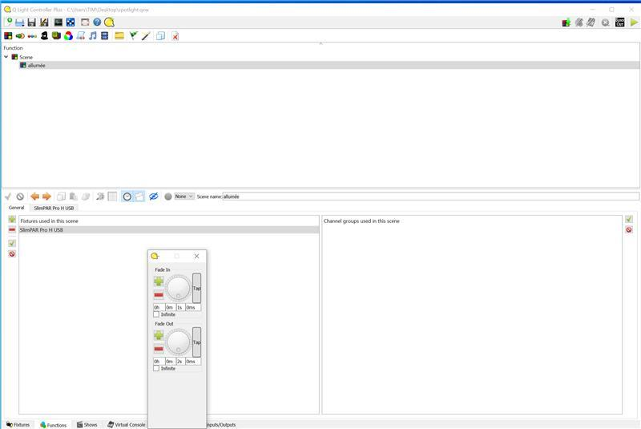
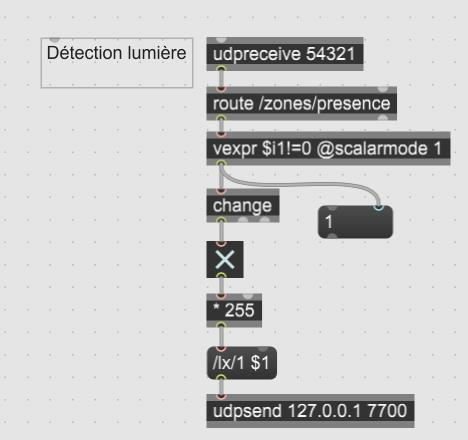
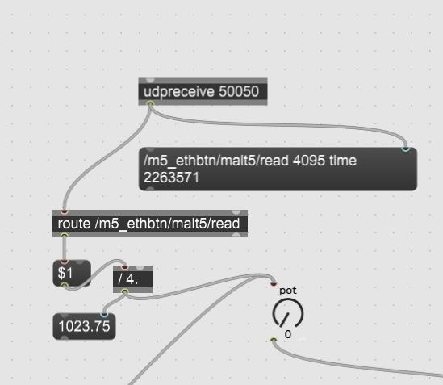
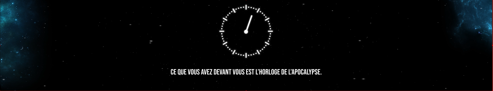
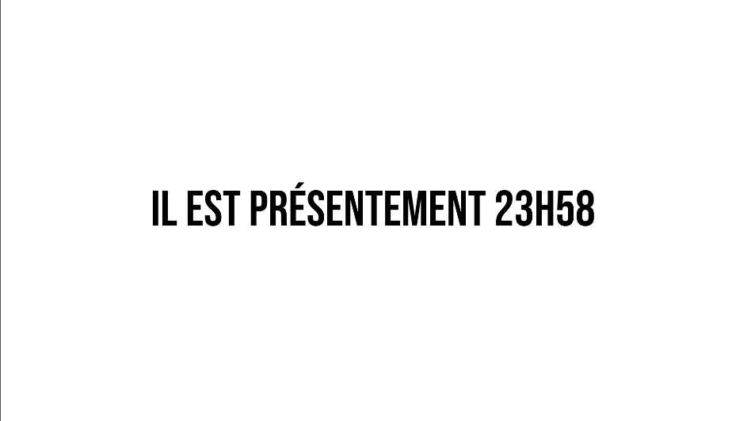
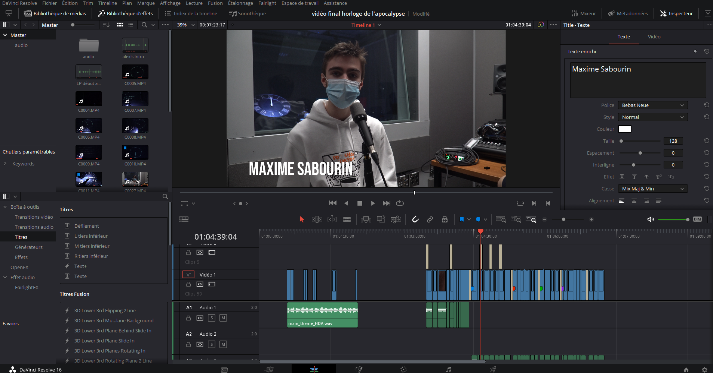

# Journal de Maxime De Falco

* [Semaine 1](#semaine-1)
* [Semaine 2](#semaine-2)
* [Semaine 3](#semaine-3)
* [Semaine 4](#semaine-4)
* [Semaine 5](#semaine-5)
* [Semaine de rattrapage](#semaine-de-rattrapage)
* [Semaine 6](#semaine-6)
* [Semaine 7](#semaine-7)
* [Semaine 8](#semaine-8)
* [Semaine 9](#semaine-9)

## Semaine 1

### Résumé des réalisations effectuées
- Copier le «repository» de Malt5 sur mon ordinateur personel. 
- Créer une arborescence dans notre répertoire «github».
- Effectuer un retour sur la préproduction en corrigeant les erreurs.
- Acheter et chercher tout le décor pour notre expérience multimédia interactive.
- Effectuer le montage pour la vidéo de la présentation de notre préproduction. 

### Images des réalisations dont tu es le plus fier

### Est-ce que j'ai accompli l'ensemble des tâches et objectifs que je m'étais fixés pour cette semaine?	
- [x] Complètement
- [ ] Assez
- [ ] Peu
- [ ] Pas du tout

#### Décrivez pourquoi.
Je trouve que nous avons pris beaucoup d'avance cette semaine. Nous avons acheté et obtenu tout le matériel physique nécessaire pour créer le décor de notre expérience multimédia. De plus, la vidéo explicative est presque terminée. Nous avons d'ailleurs corrigé les erreurs dans la préproduction afin de donner une direction beaucoup plus claire au projet. En bref, mon équipe se dirige vers la même direction artistiquement et techniquement en faveur de notre projet. 

#### S'il y a lieu, qu'allez-vous faire pour remédier à la situation?
N/A

### Mon projet s'est-il réalisé selon l’échéancier prévu?

- [x] Complètement
- [ ] Assez
- [ ] Un peu
- [ ] Pas tout à fait

#### S'il y a des écarts, décrivez-les.
N/A

#### S'il y a lieu, qu'allez-vous faire pour remédier à la situation?
N/A

### Défis pour la prochaine semaine
Finaliser le montage pour la préproduction, effectuer le journal de bord, commencer si possible à effectuer l'installation de certains éléments dans l'espace physique (piédestal, horloge, lumière, caméra) et finalement entamer le son, les images Photoshop et scénariser la vidéo où l'on explique le concept de l'horloge de l'apocalypse.

---
## Semaine 2
### Résumé des réalisations effectuées

### Image d'une réalisation dont tu es la ou le plus fier

### Est-ce que j'ai accompli l'ensemble des tâches et objectifs que je m'étais fixés pour cette semaine?

- [x] Complètement
- [ ] Assez
- [ ] Peu
- [ ] Pas du tout

#### Décrivez pourquoi.
 Nous avons écrit le scénario afin de bien scénariser notre expérience multimédia interactive. De plus, j’ai été responsable de faire le montage et l’exportation de la vidéo explicative de la préproduction. Nous avons aussi appliqué une nouvelle nomenclature aux fichiers des journaux de bord afin de ne pas mélanger les images des prochaines semaines et de bien nous retrouver au cours de la session.    

#### S'il y a lieu, qu'allez-vous faire pour remédier à la situation?
N/A

### Mon projet s'est-il réalisé selon l’échéancier prévu?

- [x] Complètement
- [ ] Assez
- [ ] Un peu
- [ ] Pas tout à fait

#### S'il y a des écarts, décrivez-les.
N/A

#### S'il y a lieu, qu'allez-vous faire pour remédier à la situation?
N/A

### Défis pour la prochaine semaine
Réenregistrer ma partie de la vidéo pour la préproduction, assurer le montage et l'exportation. De plus, je dois retravailler le scénario afin de l'améliorer. Pour finir, nous devons remettre à jour certains éléments de la préproduction dans le git-hub. 

---
## Semaine 3 
### Résumé des réalisations effectuées
Premièrement, j’ai retravaillé certains éléments du scénario afin de corriger le problème du potentiomètre qui ne pourra pas se remettre à zéro. De plus, nous avons modifié la narration de la dernière scène afin de rendre le tout plus concis. De plus, j’ai effectué ma vidéo explicative de la préproduction. Par la suite, j’ai été responsable du montage, de l’exportation et de la mise en ligne de la vidéo explicative du projet. J’ai d’ailleurs rajouté une animation à la fin de celle-ci afin de pimenter le tout et donner le goût aux utilisateurs de participer au projet. J’ai aussi mis à jour la version web du projet en expliquant son résumé.  

### Image d'une réalisation dont tu es la ou le plus fier

### Est-ce que j'ai accompli l'ensemble des tâches et objectifs que je m'étais fixés pour cette semaine?

- [x] Complètement
- [ ] Assez
- [ ] Peu
- [ ] Pas du tout

#### Décrivez pourquoi.
Je suis heureux du travail que j’ai accompli cette semaine, car nous n’avons plus le problème du potentiomètre. De plus, j’ai réeffectué la vidéo explicative de la préproduction qui est selon moi bien meilleure que notre première version. Les informations sont beaucoup plus concises et il est bien plus facile de suivre nos pensées. Nous avons aussi retravaillé la mise en page du scénario qui est beaucoup plus professionnel et mieux structuré. En bref, je trouve que notre préproduction est bien meilleure que notre version précédente et notre version web du projet est beaucoup plus complète. 

#### S'il y a lieu, qu'allez-vous faire pour remédier à la situation?
N/A

### Mon projet s'est-il réalisé selon l’échéancier prévu?

- [x] Complètement
- [ ] Assez
- [ ] Un peu
- [ ] Pas tout à fait

#### S'il y a des écarts, décrivez-les.
Notre coéquipier Louis-Philippe a été en contact avec une personne possédant la covid-19.

#### S'il y a lieu, qu'allez-vous faire pour remédier à la situation?
Nous allons lui montrer nos installations physiques en vidéoconférence et il pourra en attendant faire des médias afin de contribuer au projet bien qu’il ne puisse pas se présenter au studio.

### Défis pour la prochaine semaine
Nous devrons aller dans le grand studio afin de placer les éléments principaux dans le petit studio et tester notre installation de base. Il faudra vérifier si la projection et le son marchent bien avant de peaufiner nos médias. De plus, je me chargerais de travailler sur le code « max » afin de rectifier les modifications faites dans le scénario. Aussi, si le temps me le permet, je commencerai la vidéo de la scène 1 du projet. 
Pour les semaines à venir, il ne faudra pas oublier de mettre à jour notre préproduction constamment selon les modifications faites au cours du projet. 

---
## Semaine 4
### Résumé des réalisations effectuées
Premièrement, j’ai effectué certaines installations physiques dans le petit studio. J’ai accroché les 3 projecteurs et j’ai aidé à installer les haut-parleurs. De plus, j’ai aidé à certains changements dans le code max pour bien scénariser les changements de scène dans OBS. J’ai aussi assuré que chaque élément soit bien séquencé un à la suite de l’autre dans la console du code max. 
 

### Image d'une réalisation dont tu es la ou le plus fier

### Est-ce que j'ai accompli l'ensemble des tâches et objectifs que je m'étais fixés pour cette semaine?

- [ ] Complètement
- [x] Assez
- [ ] Peu
- [ ] Pas du tout

#### Décrivez pourquoi.
Nous n’avons pas testé entièrement les installations avec OBS comme je le souhaitais et je n’ai pas eu le temps de commencer la vidéo d’introduction de la scène d’introduction.    

#### S'il y a lieu, qu'allez-vous faire pour remédier à la situation?
Pour la semaine suivante, je vais me concentrer davantage sur les installations OBS et Madmapper afin de bien diffuser les images dans le grand studio. Selon moi il n'y a pas encore de retard au projet, car pour compenser, notre code max est entièrement fonctionnel. 

### Mon projet s'est-il réalisé selon l’échéancier prévu?

- [x] Complètement
- [ ] Assez
- [ ] Un peu
- [ ] Pas tout à fait

#### S'il y a des écarts, décrivez-les.
N/A

#### S'il y a lieu, qu'allez-vous faire pour remédier à la situation?
N/A

### Défis pour la prochaine semaine
Exécuter une projection visuelle et sonore entièrement fonctionnelle afin d’effectuer des tests dans le petit studio. J’assurerai d’installer le web socket de OBS et de charger nos scènes sur l’ordinateur de l’école. En bref, je voudrais une installation fonctionnelle pour la semaine prochaine.
---
## Semaine 5
### Résumé des réalisations effectuées
Tout d’abord, j’ai effectué la mise en place des projecteurs afin de créer le moins possible d’ombre et facilité le «mapping» dans «mad mapper». De plus, je me suis chargé de créer les scènes OBS et de recréer entièrement ce que nous avions fait la session précédente sur l’ordinateur de l’école. J’ai ensuite installé de logiciel «OSC for obs» et les plug-ins pour le «spout» de obs et le «web socket de osc for obs». J’ai ensuite connecté notre code max à obs. Pour finir j’ai fait en sorte que nos projecteurs soient reconnus dans le logiciel «madmapper» et puisse projeter nos scènes obs.  

### Image d'une réalisation dont tu es la ou le plus fier

### Est-ce que j'ai accompli l'ensemble des tâches et objectifs que je m'étais fixés pour cette semaine?

- [x] Complètement
- [ ] Assez
- [ ] Peu
- [ ] Pas du tout

#### Décrivez pourquoi.
Nous avons en grande partie fait les installations physiques dans le petit studio. Nos installations sonores sont fonctionnelles. Notre projection affiche sur les projecteurs et notre code max est entièrement fonctionnel avec nos scènes obs. Nous avons accompli un grand nombre d’objectifs qui nous seront primordial pour la suite du projet. 

#### S'il y a lieu, qu'allez-vous faire pour remédier à la situation?
N/A

### Mon projet s'est-il réalisé selon l’échéancier prévu?

- [x] Complètement
- [ ] Assez
- [ ] Un peu
- [ ] Pas tout à fait

#### S'il y a des écarts, décrivez-les.
N/A

#### S'il y a lieu, qu'allez-vous faire pour remédier à la situation?
N/A

### Défis pour la prochaine semaine
Commencer la vidéo d'introduction ainsi que la vidéo de redémarrage. De plus, démarrer la soudure du potentiomètre avec le arduino. Si le temps nous le permet, il faudrait commencer à animer les scènes dans after effect afin de rendre le tout beaucoup plus immersif.

---
## Semaine de rattrapage
### Résumé des réalisations effectuées
Cette semaine j’ai débuté la vidéo d’introduction pour le début du projet. De plus, nous avons effectué les soudures afin de brancher le potentiomètre au micro-ordinateur. J’ai travaillé en équipe sur le système de détection de lumière en positionnant la kinect et en effectuant quelque branchement dans Max. Nous avons aussi rendu la caméra fonctionnelle. De plus, j’ai remplacé une bonne partie des médias dans OBS afin de mettre les animations after-effect que mon collègue a effectué cette semaine.  

### Image d'une réalisation dont tu es la ou le plus fier

  

### Est-ce que j'ai accompli l'ensemble des tâches et objectifs que je m'étais fixés pour cette semaine?

- [x] Complètement
- [ ] Assez
- [ ] Peu
- [ ] Pas du tout

#### Décrivez pourquoi.
 Nos installations physiques sont presque terminées. La caméra et le système de détection de la lumière sont fonctionnels. 

#### S'il y a lieu, qu'allez-vous faire pour remédier à la situation?
N/A

### Mon projet s'est-il réalisé selon l’échéancier prévu?

- [x] Complètement
- [ ] Assez
- [ ] Un peu
- [ ] Pas tout à fait

#### S'il y a des écarts, décrivez-les.
Malheureusement, le potentiomètre ne fait pas une rotation parfaite de 360 dégréés donc nous allons devoir le changer.

#### S'il y a lieu, qu'allez-vous faire pour remédier à la situation?
Nous allons commander un nouveau potentiomètre et tester notre code Max avec celui-ci. Nous allons prendre un encodeur de rotation absolue pour remédier au problème.  

### Défis pour la prochaine semaine
Finaliser la vidéo d’introduction et la scène 12 du projet. Travailler avec un nouveau potentiomètre afin de le rendre entièrement fonctionnel avec notre code Max. 

---
## Semaine 6
### Résumé des réalisations effectuées
Cette semaine, je me suis chargé de compléter l’introduction, la scène de redémarrage, la scène 11 et la scène des crédits. Je me suis chargé que tous les éléments soient bien enchainés et que les transitons soit fluide. J’ai aussi assuré de mettre à jour le OBS afin de rajouter les nouvelles scènes et de modifier certains éléments dans Max pour ajuster les délais des scènes. 

### Image d'une réalisation dont tu es la ou le plus fier

### Est-ce que j'ai accompli l'ensemble des tâches et objectifs que je m'étais fixés pour cette semaine?

- [x] Complètement
- [ ] Assez
- [ ] Peu
- [ ] Pas du tout

#### Décrivez pourquoi.
Tous les éléments visuels sont complétés et j’aime beaucoup le résultat. Les transitions sont fluides et il n’y a pas de longueur. En bref, je suis heureux du résultat que j’ai accompli et mes objectifs sont atteints. . 

#### S'il y a lieu, qu'allez-vous faire pour remédier à la situation?
N/A

### Mon projet s'est-il réalisé selon l’échéancier prévu?

- [x] Complètement
- [ ] Assez
- [ ] Un peu
- [ ] Pas tout à fait

#### S'il y a des écarts, décrivez-les.
Il se peut que je modifie certains éléments pour améliorer les vidéos (polices, grosseur du texte, certains audio).

#### S'il y a lieu, qu'allez-vous faire pour remédier à la situation?
Je corrigerai les éléments la semaine prochaine puisqu’il nous reste 1 semaine avant la présentation. 

### Défis pour la prochaine semaine
Nous devons avoir un prototype fonctionnel qui fonctionne à la perfection. De plus, nous devons corriger les bogues s’il y a lieu. En bref, notre installation multimédia interactive doit être complétée.

---
## Semaine 7
### Résumé des réalisations effectuées
Tout d’abord, j’ai configuré la caméra pour obtenir les meilleurs paramètres avant le tournage. J’ai ensuite préparé le stabilisateur et tourné un petit extrait de l’expérience. Nous avons ensuite tourné la vidéo explicative du projet et j’ai été responsable de la postproduction et du montage de celle-ci.

### Image d'une réalisation dont tu es la ou le plus fier

### Est-ce que j'ai accompli l'ensemble des tâches et objectifs que je m'étais fixés pour cette semaine?

- [x] Complètement
- [ ] Assez
- [ ] Peu
- [ ] Pas du tout

#### Décrivez pourquoi.
Je suis fier de la vidéo explicative du projet. La vidéo est simple est les informations sont très concises. De plus, j’ai effectué quelques modifications à la scène d’introduction dans OBS afin de bien jumeler l’audio à la vidéo.   

#### S'il y a lieu, qu'allez-vous faire pour remédier à la situation?
N/A

### Mon projet s'est-il réalisé selon l’échéancier prévu?

- [x] Complètement
- [ ] Assez
- [ ] Un peu
- [ ] Pas tout à fait

#### S'il y a des écarts, décrivez-les.
N/A

#### S'il y a lieu, qu'allez-vous faire pour remédier à la situation?
N/A

### Défis pour la prochaine semaine
L’expérience doit être complètement complétée. De plus, devons installer le rideau qui cachera l’ordinateur durant l’expérience. Nous devons nous assurer que tous les éléments non pertinents pour l’expérience soient rangés et ne soient plus dans la pièce. Finalement, nous devrons pratiquer un texte afin de parler au public qui viendra visiter notre expérience.  

---

