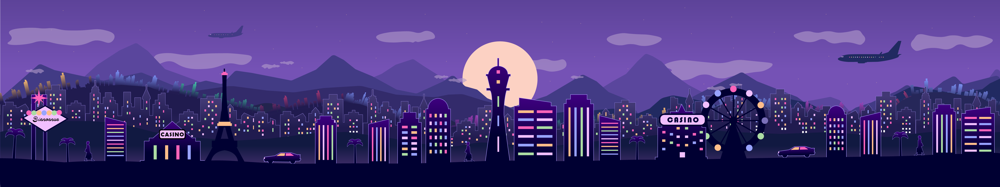

# Journal de Maxime Sabourin

* [Semaine 1](#semaine-1)
* [Semaine 2](#semaine-2)
* [Semaine 3](#semaine-3)
* [Semaine 4](#semaine-4)
* [Semaine 5](#semaine-5)
* [Semaine de rattrapage](#semaine-de-rattrapage)
* [Semaine 6](#semaine-6)
* [Semaine 7](#semaine-7)
* [Semaine 8](#semaine-8)
* [Semaine 9](#semaine-9)

## Semaine 1

### Résumé des réalisations effectuées
- Aquisition du journal.
- Début de rédaction du journal.
- Correction et finalisation de la préproduction sur Github.
- Enregistrement de la vidéo explicative de la préproduction.
- Achat de l'horloge.
- Abonnement à Eastwest Composer Cloud pour les instruments virtuels.

### Image d'une réalisation dont tu es la ou le plus fier

### Est-ce que j'ai accompli l'ensemble des tâches et objectifs que je m'étais fixés pour cette semaine?	
- [x] Complètement
- [ ] Assez
- [ ] Peu
- [ ] Pas du tout

#### Décrivez pourquoi. 
Nous nous sommes tout de suite mis au travail suite au premier cours du Mardi matin.

### Mon projet s'est-il réalisé selon l’échéancier prévu?
- [x] Complètement
- [ ] Assez
- [ ] Un peu
- [ ] Pas tout à fait

#### S'il y a des écarts, décrivez-les.
L'abonnement Eastwest Composer Cloud coûte 25$ par mois. Le renouvellement est le 12 Février. Je vais donc me concentrer sur la composition de la trame sonore du projet afin d'avoir à payer l'abonnement sur un seul mois.

#### S'il y a lieu, qu'allez-vous faire pour remédier à la situation?
Si je vois qu'il y a d'autres tâches prioritaires, je payerai également l'abonnement pour le deuxième mois.

### Défis pour la prochaine semaine
- Réaliser la composition de la trame sonore.
- Finaliser la vidéo de préproduction.

---
## Semaine 2
### Résumé des réalisations effectuées
- Production des 11 moodboards d'inspiration artistique.
- Réimagination du style général des planches artistiques.
- Composition, mixage et mastering des 11 trames sonores. (Sujet à changer)
- Correction de ma partie de la vidéo de préproduction.
- Réalisation du background de la scène 1 sur Illustrator.

### Image d'une réalisation dont tu es la ou le plus fier

### Est-ce que j'ai accompli l'ensemble des tâches et objectifs que je m'étais fixés pour cette semaine?
- [x] Complètement
- [ ] Assez
- [ ] Peu
- [ ] Pas du tout

#### Décrivez pourquoi.
N/A

#### S'il y a lieu, qu'allez-vous faire pour remédier à la situation?
N/A

### Mon projet s'est-il réalisé selon l’échéancier prévu?
- [x] Complètement
- [ ] Assez
- [ ] Un peu
- [ ] Pas tout à fait

#### S'il y a des écarts, décrivez-les.
Il y a quelques modifications à faire dans la vidéo de préproduction. Il faut davantage renchérir sur les détails au lieu de les énumérer.

#### S'il y a lieu, qu'allez-vous faire pour remédier à la situation?
Je vais réenregistrer ma partie de la vidéo de préproduction.

### Défis pour la prochaine semaine
- Réaliser les arrières plans pour les premières planches photoshop. Tenter de faire 1 à 6.

---
## Semaine 3 
### Résumé des réalisations effectuées
- Réalisation moodboard sonore.
- Réalisation des arrières plans des scènes 2 à 6.
- Exportation des 11 trames sonores finales sans les effets sonores 5.1
- finalisation de la vidéo de préproduction.
- Ammener l'horloge dans le lieu de l'installation.

### Image d'une réalisation dont tu es la ou le plus fier

### Est-ce que j'ai accompli l'ensemble des tâches et objectifs que je m'étais fixés pour cette semaine?

- [x] Complètement
- [ ] Assez
- [ ] Peu
- [ ] Pas du tout

#### Décrivez pourquoi.
 J'ai respecté l'échéancier.

#### S'il y a lieu, qu'allez-vous faire pour remédier à la situation?
N/A

### Mon projet s'est-il réalisé selon l’échéancier prévu?
- [x] Complètement
- [ ] Assez
- [ ] Un peu
- [ ] Pas tout à fait

#### S'il y a des écarts, décrivez-les.
N/A

#### S'il y a lieu, qu'allez-vous faire pour remédier à la situation?
N/A

### Défis pour la prochaine semaine
- Finir les arrières plans des scènes 7 à 11.

---
## Semaine 4
### Résumé des réalisations effectuées
- Réalisation des arrières plans des scènes 7 à 11.
- Corrections mineures sur les scènes 2 à 4.
- Réalisation d'une nouvelle trame sonore pour la scène 8 (années 80).
- Réalisation des effets sonores d'arrière plan pour les 11 scènes.
- Installer les hauts-parleurs aux quatre coins de l'installation.

### Image d'une réalisation dont tu es la ou le plus fier

### Est-ce que j'ai accompli l'ensemble des tâches et objectifs que je m'étais fixés pour cette semaine?
- [x] Complètement
- [ ] Assez
- [ ] Peu
- [ ] Pas du tout

#### Décrivez pourquoi.
 J'ai atteint mon objectif de finir les arrières plans et j'ai fait du travail supplémentaire.

#### S'il y a lieu, qu'allez-vous faire pour remédier à la situation?
N/A

### Mon projet s'est-il réalisé selon l’échéancier prévu?
- [x] Complètement
- [ ] Assez
- [ ] Un peu
- [ ] Pas tout à fait

#### S'il y a des écarts, décrivez-les.
N/A

#### S'il y a lieu, qu'allez-vous faire pour remédier à la situation?
N/A

### Défis pour la prochaine semaine
- Faire le illustrator final des scènes 6 à 8.
- Continuer l'installation du matériel dans le studio. Rendre le son quadraphonique fonctionnel.

---
## Semaine 5
### Résumé des réalisations effectuées
- Montage illustrator complet des scènes 6 à 10.
- Installation du matériel dans le petit studio (surtout en ce qui concerne le son).
- Le son quadraphonique est maintenant fonctionnel.

### Image d'une réalisation dont tu es la ou le plus fier

### Est-ce que j'ai accompli l'ensemble des tâches et objectifs que je m'étais fixés pour cette semaine?

- [x] Complètement
- [ ] Assez
- [ ] Peu
- [ ] Pas du tout

#### Décrivez pourquoi.
 Je m'étais fixé l'objectif de finir les scènes 6 à 8, j'en ai fait 2 de plus.

#### S'il y a lieu, qu'allez-vous faire pour remédier à la situation?
N/A

### Mon projet s'est-il réalisé selon l’échéancier prévu?

- [x] Complètement
- [ ] Assez
- [ ] Un peu
- [ ] Pas tout à fait

#### S'il y a des écarts, décrivez-les.
Le son ne peut pas être 'monitoré' (donc diffusé) en 4.1 sur OBS. 

#### S'il y a lieu, qu'allez-vous faire pour remédier à la situation?
Il faut donc passer par Max8. Heureusement, Daryl m'a montré comment le 4.1 fonctionne dans Max8.

### Défis pour la prochaine semaine
Le son doit être finaliser dans l'espace interactif. (Musique et SFX jouent dans tous les 4 hauts-parleurs et le subwoofer)
---
## Semaine de rattrapage
### Résumé des réalisations effectuées
- Le son est maintenant complètement fonctionnel, il se déclenche à partir de Max8 au bon moment et joue dans les 4 hauts-parleurs correctement.
- Réalisation de la dernière scène illustrator.
- Réalisation de toutes les animations des scènes sur after effects (sujet à changer).

### Image d'une réalisation dont tu es la ou le plus fier

### Est-ce que j'ai accompli l'ensemble des tâches et objectifs que je m'étais fixés pour cette semaine?

- [x] Complètement
- [ ] Assez
- [ ] Peu
- [ ] Pas du tout

#### Décrivez pourquoi.
 J'ai réalisé le but que je m'étais fixé en ce qui concerne l'espace interactif et j'ai finalisé les animations des scènes principales en plus.

#### S'il y a lieu, qu'allez-vous faire pour remédier à la situation?
N/A

### Mon projet s'est-il réalisé selon l’échéancier prévu?

- [x] Complètement
- [ ] Assez
- [ ] Un peu
- [ ] Pas tout à fait

#### S'il y a des écarts, décrivez-les.
N/A

#### S'il y a lieu, qu'allez-vous faire pour remédier à la situation?
N/A

### Défis pour la prochaine semaine
- Aider à installer et faire fonctionner les éléments dans l'espace interactif.
- Aider au plan sonore et graphique pour la réalisation des scènes d'introduction et de conclusion de l'oeuvre.

---
## Semaine 6
### Résumé des réalisations effectuées
- Réalisation d'une trame sonore pour la scène d'intro.
- Mix de la voix de la narratrice.
- Réalisation de plusieurs effets sonores tels que les explosions, le téléphone et le missile.
- Révision des scènes 5, 11 et 12 sur after effects.
- Aider à réaliser le patch Max8.

### Image d'une réalisation dont tu es la ou le plus fier

### Est-ce que j'ai accompli l'ensemble des tâches et objectifs que je m'étais fixés pour cette semaine?

- [x] Complètement
- [ ] Assez
- [ ] Peu
- [ ] Pas du tout

#### Décrivez pourquoi.
 N/A

#### S'il y a lieu, qu'allez-vous faire pour remédier à la situation?
N/A

### Mon projet s'est-il réalisé selon l’échéancier prévu?

- [x] Complètement
- [ ] Assez
- [ ] Un peu
- [ ] Pas tout à fait

#### S'il y a des écarts, décrivez-les.
Daryl m'a proposé de faire une révision sur les trames sonores des scènes 9 et 11 au sujet de l'intensité des trames.

#### S'il y a lieu, qu'allez-vous faire pour remédier à la situation?
Je vais tenter de faire des modifications sur ces trames sonores sans les dénaturer.

### Défis pour la prochaine semaine
- Finaliser l'ensemble de l'installation et des médias du projet.
---
## Semaine 7
### Résumé des réalisations effectuées
- Passer la machine à vapeur sur les toiles de projection afin d'enlever les plis.
- Faire des retouches finales sur le son qui joue dans le téléphone.
- Aider à faire le montage de la vidéo de présentation.

### Image d'une réalisation dont tu es la ou le plus fier

### Est-ce que j'ai accompli l'ensemble des tâches et objectifs que je m'étais fixés pour cette semaine?

- [x] Complètement
- [ ] Assez
- [ ] Peu
- [ ] Pas du tout

#### Décrivez pourquoi.
 N/A

#### S'il y a lieu, qu'allez-vous faire pour remédier à la situation?
N/A

### Mon projet s'est-il réalisé selon l’échéancier prévu?

- [x] Complètement
- [ ] Assez
- [ ] Un peu
- [ ] Pas tout à fait

#### S'il y a des écarts, décrivez-les.
Il reste un seul "bug" qui peut potentiellement altérer l'expérience d'un interacteur.

#### S'il y a lieu, qu'allez-vous faire pour remédier à la situation?
Il faut appliquer un autre "gate" dans le patch Max8.

### Défis pour la prochaine semaine
Faire les dernières retouches sur l'installation et se préparer à la présentation de l'oeuvre.

## Semaine 8

## Semaine 9
