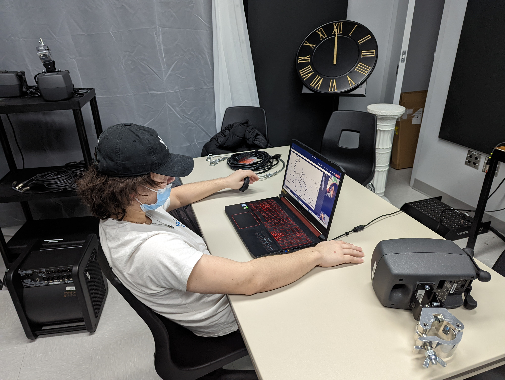
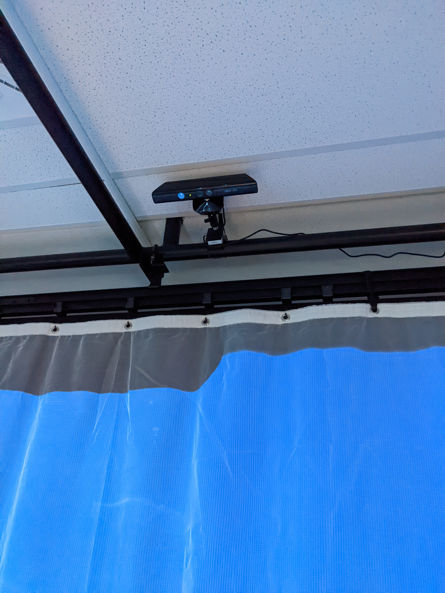

# Journal de Tristan Girard-Montpetit

* [Semaine 1](#semaine-1)
* [Semaine 2](#semaine-2)
* [Semaine 3](#semaine-3)
* [Semaine 4](#semaine-4)
* [Semaine 5](#semaine-5)
* [Semaine de rattrapage](#semaine-de-rattrapage)
* [Semaine 6](#semaine-6)
* [Semaine 7](#semaine-7)
* [Semaine 8](#semaine-8)
* [Semaine 9](#semaine-9)

## Semaine 1

### Résumé des réalisations effectuées
- Début de la session
- Recherche d'un horloge et d'un piedestale
- Trouver un téléphone ancien
- Début du Journal
- Titre pour Projet

### Image d'une réalisation dont tu es la ou le plus fier

### Est-ce que j'ai accompli l'ensemble des tâches et objectifs que je m'étais fixés pour cette semaine?	
- [x] Complètement
- [ ] Assez
- [ ] Peu
- [ ] Pas du tout

#### Décrivez pourquoi.
Car en plus d'avoir réussi les objectifs fixer par les professeurs nous avons pris de l'avance en allant à la recherche de nos objets ainsi que bien avancer notre préprod.

#### S'il y a lieu, qu'allez-vous faire pour remédier à la situation?

### Mon projet s'est-il réalisé selon l’échéancier prévu?

- [x] Complètement
- [ ] Assez
- [ ] Un peu
- [ ] Pas tout à fait

#### S'il y a des écarts, décrivez-les.
Il y eu certain écarts car après plusieurs heures de travail. Tout le monde à commencer dans toutes les sens mais nous avons vites repris la situation en main.

#### S'il y a lieu, qu'allez-vous faire pour remédier à la situation?
Seulement prendre plus de poses éviter les longues périodes de travails sans pose.

### Défis pour la prochaine semaine
Aller chercher le piedestale car la pluspart son très loin.

---
## Semaine 2
### Résumé des réalisations effectuées
- Rencontre professeurs
- Réparation téléphone antique
- Rencontre pour mettre le projet et les problèmes au clair
- Recherche pour et évaluation des possibilité pour faire le téléphone
- Refaire la vidéo de la préprod 

### Image d'une réalisation dont tu es la ou le plus fier

### Est-ce que j'ai accompli l'ensemble des tâches et objectifs que je m'étais fixés pour cette semaine?

- [x] Complètement
- [ ] Assez
- [ ] Peu
- [ ] Pas du tout

#### Décrivez pourquoi.
 

#### S'il y a lieu, qu'allez-vous faire pour remédier à la situation?

### Mon projet s'est-il réalisé selon l’échéancier prévu?

- [x] Complètement
- [ ] Assez
- [ ] Un peu
- [ ] Pas tout à fait

#### S'il y a des écarts, décrivez-les.

#### S'il y a lieu, qu'allez-vous faire pour remédier à la situation?

### Défis pour la prochaine semaine
Tout particulièrement essayer de se mettre au prototyapge et réussir à trouver une solution pour la remise à zéro de l'horloge. Finir plusieurs photoshop.

---
## Semaine 3 
### Résumé des réalisations effectuées
Cette semaine à été utilisé pour bien complété la préproduction et aussi commencer la production.
- J'ai fait des assets pour différentes scènes.
- Tester comment mettre l'horloge  sur le piedestal.
- Vérifier comment résoudre le problème de remettre l'horloge à zéro
- Continuer à apprendre comment jouer avec le téléphone mais surtout défénir plus clairement ce que nous voulons faire avec celui-ci.
- S'occuper de la facette web du projet

### Image d'une réalisation dont tu es la ou le plus fier

### Est-ce que j'ai accompli l'ensemble des tâches et objectifs que je m'étais fixés pour cette semaine?

- [ ] Complètement
- [x] Assez
- [ ] Peu
- [ ] Pas du tout

#### Décrivez pourquoi.
 Tout c'est bien passer mais j'aurais du prendre plus de photo de mes accomplissment.

#### S'il y a lieu, qu'allez-vous faire pour remédier à la situation?

### Mon projet s'est-il réalisé selon l’échéancier prévu?

- [x] Complètement
- [ ] Assez
- [ ] Un peu
- [ ] Pas tout à fait

#### S'il y a des écarts, décrivez-les.

#### S'il y a lieu, qu'allez-vous faire pour remédier à la situation?

### Défis pour la prochaine semaine
Je dois savoir très clairement ce que le téléphone fera, me faire un plan dequoi faire pour le téléphone et faire du protypage de placement dans le petit studio.

---
## Semaine 4
### Résumé des réalisations effectuées
- Manque pour l'inventaire
- Assets pour différentes scènes
- Modificartion du AI pour le rendre moins cliché
- J'ai déterminé l'utilisation du téléphone
- J'ai commencé la production en sachant quoi faire sur le téléphone
- Installation dans le studio du système de son
- Installation de la carte de son

### Image d'une réalisation dont tu es la ou le plus fier

### Est-ce que j'ai accompli l'ensemble des tâches et objectifs que je m'étais fixés pour cette semaine?

- [x] Complètement
- [ ] Assez
- [ ] Peu
- [ ] Pas du tout

#### Décrivez pourquoi.
 

#### S'il y a lieu, qu'allez-vous faire pour remédier à la situation?

### Mon projet s'est-il réalisé selon l’échéancier prévu?

- [x] Complètement
- [ ] Assez
- [ ] Un peu
- [ ] Pas tout à fait

#### S'il y a des écarts, décrivez-les.

#### S'il y a lieu, qu'allez-vous faire pour remédier à la situation?

### Défis pour la prochaine semaine
- Souder une partie dans les fils du téléphone
- Continuer l'installation et faire des tests dans le petit studio avec projection et son
- Continuer les scènes photoshop
- Aider à la production du max

---
## Semaine 5
### Résumé des réalisations effectuées
Pour ma part je me suis énormement concentré sur le téléphone.
- J'ai été trouver clairement ce qui allait être fait avec la téléphone
- Un prototypage de téléphone à été fait
- Aussi j'ai acheté le matériel pour le téléphone
- J'ai fait des recherches pour le son qui sortira de celui-ci
- Les soudures sont fait dans le téléphone
- J'ai fait des recherches pour la voix
- Pour finir plusieurs choses on été fait dans le studio

### Image d'une réalisation dont tu es la ou le plus fier

### Est-ce que j'ai accompli l'ensemble des tâches et objectifs que je m'étais fixés pour cette semaine?

- [x] Complètement
- [ ] Assez
- [ ] Peu
- [ ] Pas du tout

#### Décrivez pourquoi.
 

#### S'il y a lieu, qu'allez-vous faire pour remédier à la situation?

### Mon projet s'est-il réalisé selon l’échéancier prévu?

- [x] Complètement
- [ ] Assez
- [ ] Un peu
- [ ] Pas tout à fait

#### S'il y a des écarts, décrivez-les.

#### S'il y a lieu, qu'allez-vous faire pour remédier à la situation?

### Défis pour la prochaine semaine
- Commencer à faire le protoype physique de l'horloge
- Faire la voix du narrateur
- Bien avancer le son du téléphone
---
## Semaine de rattrapage
### Résumé des réalisations effectuées
Cette semaine aura été un peu plus tranquille pour moi. J'ai utilisé le début de semaine pour compléter des trucs personnel.
J'ai quand même fait des trucs.
- J'ai rédiger le journal collectif
- Refait une partie du texte d'intro et je l'ai révisé
- J'ai chercher une narratrice
- Nous avons trouver un narratrice
- J'ai pris le temps de m'assurer de la qualité du jeu d'acteur
- Sinon j'ai beaucoup aider au placement de truc dans le studio
- J'ai aussi essayer des trucs pour les sons du téléphone
- J'ai aider au prototypage de l'horloge

### Image d'une réalisation dont tu es la ou le plus fier

### Est-ce que j'ai accompli l'ensemble des tâches et objectifs que je m'étais fixés pour cette semaine?

- [ ] Complètement
- [x] Assez
- [ ] Peu
- [ ] Pas du tout

#### Décrivez pourquoi.
 Le son dans le téléphone et le téléphone comporte maintenant des embuches. Nous avons finalement décidé de mettre un bouton pour activer celui-ci. Aussi le média du son du téléphone ne me convaint jamais réellement et j'aimerais faire quelque chose de plus professionnel j'ai demandé de l'aide à mon collègue Maxime.

#### S'il y a lieu, qu'allez-vous faire pour remédier à la situation?

### Mon projet s'est-il réalisé selon l’échéancier prévu?

- [ ] Complètement
- [x] Assez
- [ ] Un peu
- [ ] Pas tout à fait

#### S'il y a des écarts, décrivez-les.
Comme dit au paravant le téléphone n'avance pas comme je le voudrais.

#### S'il y a lieu, qu'allez-vous faire pour remédier à la situation?

### Défis pour la prochaine semaine
- Finir le téléphone le plus possible
- avoir un prototype plus complet de l'horloge
---
## Semaine 6
### Résumé des réalisations effectuées
Cette semaine, nous rentrons dans le rush de fin donc la productivité est à son maximum.
- J'ai finaliser le son qui sortira du téléphone
- Terminer les soudures du téléphone
- Aide à l'installation de l'horloge
- Schéma de branchement du nouveau circuit de l'horloge

### Image d'une réalisation dont tu es la ou le plus fier

### Est-ce que j'ai accompli l'ensemble des tâches et objectifs que je m'étais fixés pour cette semaine?

- [x] Complètement
- [ ] Assez
- [ ] Peu
- [ ] Pas du tout

#### Décrivez pourquoi.
 

#### S'il y a lieu, qu'allez-vous faire pour remédier à la situation?

### Mon projet s'est-il réalisé selon l’échéancier prévu?

- [ ] Complètement
- [x] Assez
- [ ] Un peu
- [ ] Pas tout à fait

#### S'il y a des écarts, décrivez-les.
Tout avance bien mais nous rentrons dans des taches plus techniques. Il est plus difficile de continuer car les choses à faire sortes régulièrement de nos connaissances.
En plus de cela le stress monte et le temps manque. L'équipe est donc plus sensible au tentions mais nous sommes une équipe soudé et savons comment régler les problèmes
et s'entraider.

#### S'il y a lieu, qu'allez-vous faire pour remédier à la situation?

### Défis pour la prochaine semaine
- Finaliser et tester le plus possibles.
---
## Semaine 7
### Résumé des réalisations effectuéesà
Cette semaine, nous avons finaliser le projet.
- J'ai fini le téléphone
- Ajouter un stopper à l'horloge
- Fait le ménage
- Ajuster les rideaux et repasser

### Image d'une réalisation dont tu es la ou le plus fier
(Je n'ai pas vraiment d'image mais je crois que le projet en sois en est une bonne)

### Est-ce que j'ai accompli l'ensemble des tâches et objectifs que je m'étais fixés pour cette semaine?

- [x] Complètement
- [ ] Assez
- [ ] Peu
- [ ] Pas du tout

#### Décrivez pourquoi.
 

#### S'il y a lieu, qu'allez-vous faire pour remédier à la situation?

### Mon projet s'est-il réalisé selon l’échéancier prévu?

- [x] Complètement
- [ ] Assez
- [ ] Un peu
- [ ] Pas tout à fait

#### S'il y a des écarts, décrivez-les.

#### S'il y a lieu, qu'allez-vous faire pour remédier à la situation?

### Défis pour la prochaine semaine
-Terminer le projet et le présenter !

## Semaine 8

## Semaine 9
