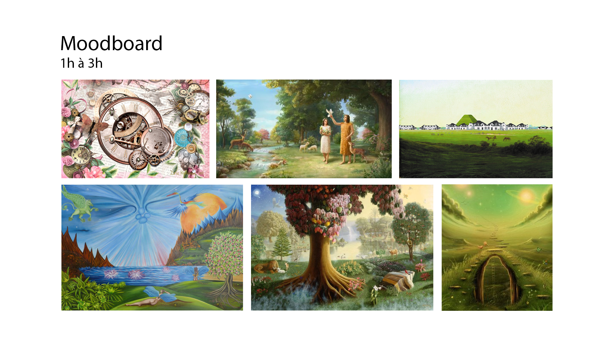

# Préproduction
> C'est ici qu'on dépose les éléments de la préproduction.

# Table des matières
1. [Intention ou concept](#Intention-ou-concept)
    - [Cartographie](#Cartographie)
    - [Intention de départ](#Intention-de-départ)
    - [Synopsis](#Synopsis)
    - [Tableau d'ambiance (*moodboard*)](#Tableau-d'ambiance-(*moodboard*))
    - [Scénario, scénarimage ou document audio/visuel](#Scénario,-scénarimage-ou-document-audio/visuel)
2. [Contenu multimédia à intégrer](#Contenu-multimédi-à-intégrer)
    - [Inventaire du contenu multimédia](#Inventaire-du-contenu-multimédia)
    - [Univers artistique des éléments](#Univers-artistique-des-éléments)
3. [Planification technique d'un prototype (devis technique)](#Planification-technique-(devis-technique))
    - [Schémas ou plans techniques](#Schémas-ou-plans-techniques)
    - [Matériaux requis](#Matériaux-de-scénographie-requis)
    - [Équipements requis](#Équipements-requis)
    - [Logiciels requis](#Logiciels-requis)
    - [Ressources humaines requises](#Ressources-humaines-requises)
    - [Ressources spatiales requises (rangement et locaux)](#Ressources-spatiales-requises-(rangement-et-locaux))
    - [Contraintes techniques et potentiels problèmes de production](#Contraintes-techniques-et-potentiels-problèmes-de-production)
4. [Planification de la production d'un prototype (budget et étapes de réalisation)](#Planification-de-la-production-(budget-et-étapes-de-réalisation))
    - [Budget prévisionnel](#Budget-prévisionnel)
    - [Échéancier global](#Échéancier-global)
    - [Liste des tâches à réaliser](#Liste-des-tâches-à-réaliser)
    - [Rôles et responsabilités des membres de l'équipe](#Rôles-et-responsabilités-des-membres-de-l'équipe))
    - [Moments des rencontres d'équipe](#Moments-des-rencontres-d'équipe)

# Intention ou concept
## Cartographie
> Exemples:
 

## Intention de départ
Ce projet représente l'impact collectif sur les événements socio-politique et environnementaux qui ce produisent tout au long du temps de l'humanité.

## Synopsis
L'interacteur arrive dans une salle, il a la possibillité de jouer avec les aiguilles de l'horloge pour faire avancer ou reculer le temps et ainsi constater que le monde va mal et qu'il est temps d'agir. 

Le public est appelé à réaliser le peu de temps qu'il reste à l'humanité selon l'horloge de l'apocalypse. 

## Tableau d'ambiance (*moodboard*)

[Exemple de tableaux d'ambiance visuels (images, couleurs, typographie)](https://cmontmorency365.sharepoint.com/sites/TIM-58266B-Expriencemultimdiainteractive-Enseignants/Documents%20partages/Enseignants/hiv2021_expMulti_582-66BMO/4_Contenu/Modeles/tableau_ambiance/1_tableau_ambiance_exemple.pdf)

## Scénario, scénarimage ou document audio/visuel
Scénario:

Introduction: Le spectateur entre dans la salle et un narrateur enfant explique le concept de l'horloge de l'apocalypse. Un projecteur s'ouvre sur l'horloge pour que le spectateur s'en approche.

Déroulement: Le spectateur peut faire tourner les aiguilles de l'horloge pour faire avancer le temps de l'horloge de l'apocalypse. Les différentes heures représentent l'évolution d'une plaine sur 12 scènes au fil du temps pour montrer le destruction qui s'installe. Cette projection sera sur 3 murs pour une immersion totale.

Conclusion: Quand l'horloge atteint minuit, une courte vidéo montrant un décompte d'horloge est projetée puis un téléphone placé sur une table sonne. Le spectateur répond et le narrateur explique de façon poétique qu'il est temps d'agir. La personne est filmée par une caméra et son image est projetée tout autour d'elle avec les 3 projecteurs. Après quelques secondes, les projecteurs s'éteignent.

# Contenu multimédia à intégrer
## Inventaire du contenu multimédia
*  12 photoshop de plaine
*  13 after effects des scènes
*  Effets sonores
*  12 trames sonores reliés aux scènes
*  4 textes pour les scènes d'intro et de fin
*  4 modules multimédia (captation des données, interprétation des données, contrôle d'éclairage, contrôle vidéo)

Pour plus de détails: [Inventaire du contenu à intégrer](https://cmontmorency365-my.sharepoint.com/:x:/g/personal/1945969_cmontmorency_qc_ca/ERKCSlUJhTFEp-WwGbcpxx0BK9-bCbdidCFUX_tMK-mZ6w?e=4yY9z0)

## Univers artistique des éléments

*  Horloge : https://www.google.com/url?sa=i&url=https%3A%2F%2Fwww.ikea.com%2Fca%2Ffr%2Fp%2Ftjalla-horloge-murale-80357878%

* Téléphone : https://www.google.com/url?sa=i&url=https%3A%2F%2Fwww.ebay.ca%2Fitm%2F113658824204&psig=AOvVaw1kWxdNjVPTvC-Xngt2qiIv&ust=1638914184210000&source=images&cd=vfe&ved=0CAsQjRxqFwoTCPjhr5-V0PQCFQAAAAAdAAAAABAG

* Piédestal : https://www.google.com/url?sa=i&url=https%3A%2F%2Fwww.homedepot.ca%2Fproduit%2Funiquewise-decor-blanc-en-fibre-de-verre-de-style-romain-colonne-piedestal-presentoir-vase-de-fleurs-47-5-%2F1001614852&psig=AOvVaw2uyYwl_OjJhll74_MZ1QN4&ust=1638911411707000&source=images&cd=vfe&ved=0CAsQjRxqFwoTCKDap_WK0PQCFQAAAAAdAAAAABAE

# Planification technique d'un prototype (devis technique)
## Schémas ou plans techniques
> Insérer plans, documents et schémas pertinents dans cette section.  

### Plantation 

### Schéma de branchement 

## Matériel de scénographie requis

> Liste des matériaux de scénographie (matériaux de décor) requis ou lien vers un tableur Excel ou document Markdown à part si nécessaire (quantité, spécifications techniques, lien vers fiche technique si applicable, commentaires...)

* Téléphone
    * à roulette

* Piédestal romain
    * Mesures

* Horloge 
    * Chiffres romains

## Équipements requis
> Liste des équipements requis par département ou lien vers un tableur Excel ou document Markdown à part si nécessaire (quantité, spécifications techniques, lien vers fiche technique si applicable, commentaires...)

* Audio
    * 4 haut-parleurs 
    * 8 fils XLR 3 
    * focusright carte de son

* Vidéo
    * 4 projecteurs vidéo lentille standard
    * 4 système d'acrochage
    * 1 webcam logitech c920

* Lumière
 
    * un spotlight
    * 2 fils XLR 3 conducteurs de 20'
    * Console DMX
    * Interface DMX USB

* Électricité
    * 8 cordons IEC (pour l'alimentation des haut-parleurs)
    * 2 extensions 3 fiches et 3 conducteurs 
    * 2 multiprise

* Réseau
    * 5 fils ethernet

* Ordinateur
    * 1 ordinateur de l'école ou 2 si le premier ne suffit pas 
    * 2 micro-ordinateur (Arduino)
    
* Autre
    * Tout autre élément pertinent
    * capteur de mouvement (kinect) pour le spotlight
    * 1 potentiomètre
    * 1 photorésistance
    * 1 bouton
    * 8 safety

## Logiciels requis
> Liste des logiciels requis, version ainsi que leurs dépendences

* nodeJS
* Max 8
* Photoshop
* After Effects
* MadMapper
* Arduino
* OBS Studio
* GitHub Desktop
* Davinci Resolve

## Ressources humaines requises
> Formaté en liste ou en lien vers un tableur Excel.

* TTP, location de matériel
* Professeurs de techniques pour assistance
* Membres de l'équipe

## Ressources spatiales requises (rangement et locaux)
> Spécifications des espaces nécessaires formaté en liste ou lien vers un tableur Excel.

* Grand studio
    * Projection vidéo
    * Captation vidéo
    * Lumières

## Contraintes techniques et potentiels problèmes de production
> Tableau ou lien vers un tableur Excel (contraintes, problème et solution envisagée, commentaires...)

| Contrainte ou problème potentiel                 | Solution envisagée                                    | Commentaires                                                                                 |
|--------------------------------------------------|-------------------------------------------------------|----------------------------------------------------------------------------------------------|
| Code Arduino de l'horloge qui ne fonctionne pas | Demander de l'aide au professeur ou sur l'Internet| Sinon, nous pourrions trouver une alternative à l'interactivité |
| Gestion du temps | Mieux planifier le temps et les tâches des membres | Il faudrait faire plus de réunions d'équipe pour se coordonner. 
| Trouver les éléments du décor. | Les remplacer par d'autres objets qui pourront remplir les mêmes fonctions  | Trouver des éléments à acheter en ligne pas trop loin de chez nous.                                       |                                                       |                                                                                              |

# Planification de la production d'un prototype (budget et étapes de réalisation)
## Budget prévisionnel

[Lien vers document](https://cmontmorency365.sharepoint.com/:x:/s/TIM-58266B-Expriencemultimdiainteractive-Enseignants/ERS3zx4iKAlLn03N_0h3cyQBOV_nxNuKvrKnqmrXGcgDYg?e=Rjq9Uc)

## Échéancier global
Étapes importantes du projet visualisé dans GitHub (*milestones*):  
https://github.com/MALT5/L-horloge-de-l-apocalypse/milestones

*Dates importantes :*
- Première itération : lundi 8 novembre
- Prototype finale : lundi 13 décembre
- Présentation des projets devant public : jeudi 25 mars (soir)

## Liste des tâches à réaliser
Visualisation des tâches à réaliser dans GitHub selon la méthode Kanban:  
https://github.com/MALT5/L-horloge-de-l-apocalypse/projects/1

Inventaire des tâches à réaliser dans GitHub selon le répertoire d'*issues*:  
https://github.com/MALT5/L-horloge-de-l-apocalypse/issues

## Rôles et responsabilités des membres de l'équipe
> Il vous est proposé ici de nommer une personne à la coordination générale du projet, à la coordination technique et à la coordination artistique. Les grandes décisions sur les grandes orientations du projet devraient se prendre en groupe lors de rencontres d'équipe. Cependant, les décisions entre vos rencontres de groupe devraient appartenir à ces personnes.

**Louis-Philippe Gravel**
- Coordination générale du projet (coordination de l'échéancier, du budget, suivi de la liste des tâches à réaliser, s'assurer de la répartition du rôle et des responsabilités des membres de l'équipe);
- Programmation du module Max de contrôle vidéo.

Liste des tâches dans Git Hub:  
https://github.com/MALT5/L-horloge-de-l-apocalypse/issues?q=assignee%3ALouis1er+is%3Aopen

https://github.com/MALT5/L-horloge-de-l-apocalypse/projects/1?card_filter_query=assignee%3Alouis1er

**Maxime Sabourin**
- Comité Technique et coordination technique (suivi du devis technique);
- Création des paysages sonores sonores;
- Programmation du module Max d'effet et de contrôle audio;
- Installation de l'équipement dans l'espace physique.

Liste des tâches dans Git Hub:  
https://github.com/MALT5/L-horloge-de-l-apocalypse/issues?q=assignee%3AMaxiS92+is%3Aopen

https://github.com/MALT5/L-horloge-de-l-apocalypse/projects/1?card_filter_query=assignee%3Amaxis92

**Maxime De Falco**
- Installation et mise en place de la capture audiovidéo du projet en temps réel;
- Programmation du module de captation des données;
- Programmation du module de diffusion via OBS

Liste des tâches dans Git Hub:  
https://github.com/MALT5/L-horloge-de-l-apocalypse/issues?q=assignee%3AMaxime26tim+is%3Aopen

https://github.com/MALT5/L-horloge-de-l-apocalypse/projects/1?card_filter_query=assignee%3Amaxime26tim

**Alexis Lacasse**
- Coordination artistique (attention plus particulière pour s'assurer que l'intention/concept artistique du projet initial reste, sinon consulter les membres de l'équipe);
- Création des textes
- Création des vidéos d'animation 2D;

Liste des tâches dans Git Hub:  
https://github.com/MALT5/L-horloge-de-l-apocalypse/issues?q=assignee%3Aalxi21+is%3Aopen

https://github.com/MALT5/L-horloge-de-l-apocalypse/projects/1?card_filter_query=assignee%3Aalxi21

**Tritan Girard-Montpetit**
- Création des images;
- Programmation du module Max d'éclairage;
- Programmation du module Max de contrôle de la navigation utilisateur.

Liste des tâches dans Git Hub:  
https://github.com/MALT5/L-horloge-de-l-apocalypse/issues?q=assignee%3Aboub229+is%3Aopen

https://github.com/MALT5/L-horloge-de-l-apocalypse/projects/1?card_filter_query=assignee%3Aboub229

**Tâches pas encore attribuées**  
https://github.com/tim-montmorency/66B-modele_de_projet/issues?q=is%3Aopen+is%3Aissue+no%3Aassignee

## Moments des rencontres d'équipe
Hebdomadaire
- **1 jour (jeudi) 20-30 min** : Rencontre de suivi de projet.

Autre: 
- **"lundi" jour 1h** : Rencontre de suivi de projet.
