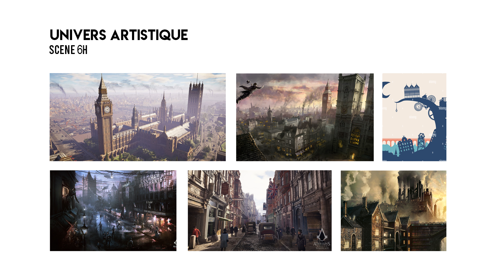

# Préproduction
> C'est ici qu'on dépose les éléments de la préproduction.

# Table des matières
1. [Intention ou concept](#Intention-ou-concept)
    - [Cartographie](#Cartographie)
    - [Intention de départ](#Intention-de-départ)
    - [Synopsis](#Synopsis)
    - [Tableau d'ambiance (*moodboard*)](#Tableau-d'ambiance-(*moodboard*))
    - [Scénario, scénarimage ou document audio/visuel](#Scénario,-scénarimage-ou-document-audio/visuel)
2. [Contenu multimédia à intégrer](#Contenu-multimédi-à-intégrer)
    - [Inventaire du contenu multimédia](#Inventaire-du-contenu-multimédia)
    - [Univers artistique des éléments](#Univers-artistique-des-éléments)
3. [Planification technique d'un prototype (devis technique)](#Planification-technique-(devis-technique))
    - [Schémas ou plans techniques](#Schémas-ou-plans-techniques)
    - [Matériaux requis](#Matériaux-de-scénographie-requis)
    - [Équipements requis](#Équipements-requis)
    - [Logiciels requis](#Logiciels-requis)
    - [Ressources humaines requises](#Ressources-humaines-requises)
    - [Ressources spatiales requises (rangement et locaux)](#Ressources-spatiales-requises-(rangement-et-locaux))
    - [Contraintes techniques et potentiels problèmes de production](#Contraintes-techniques-et-potentiels-problèmes-de-production)
4. [Planification de la production d'un prototype (budget et étapes de réalisation)](#Planification-de-la-production-(budget-et-étapes-de-réalisation))
    - [Budget prévisionnel](#Budget-prévisionnel)
    - [Échéancier global](#Échéancier-global)
    - [Liste des tâches à réaliser](#Liste-des-tâches-à-réaliser)
    - [Rôles et responsabilités des membres de l'équipe](#Rôles-et-responsabilités-des-membres-de-l'équipe))
    - [Moments des rencontres d'équipe](#Moments-des-rencontres-d'équipe)

# Intention ou concept
## Cartographie
> Exemples:
 

## Intention de départ
Ce projet représente l'impact collectif sur les événements socio-politiques et environnementaux qui se produisent tout au long du temps de l'humanité. Nous abordons ce sujet à travers le concept de l'horloge de l'apocalypse. Selon ce concept, il est présentement 23h58 et la fin du monde est à 24h00.

## Synopsis
L'interacteur arrive dans une salle, il a la possibillité de jouer avec les aiguilles de l'horloge pour faire avancer ou reculer le temps et ainsi constater les changements négatifs et qu'il est temps d'agir. 

Le public est appelé à se rendre compte du peu de temps qu'il reste à l'humanité selon l'horloge de l'apocalypse. 

## Tableau d'ambiance (*moodboard*)

[Exemple de tableaux d'ambiance visuels (images, couleurs, typographie)](https://cmontmorency365.sharepoint.com/sites/TIM-58266B-Expriencemultimdiainteractive-Enseignants/Documents%20partages/Enseignants/hiv2021_expMulti_582-66BMO/4_Contenu/Modeles/tableau_ambiance/1_tableau_ambiance_exemple.pdf)

## Scénario, scénarimage ou document audio/visuel

Scénario Horloge de l’Apocalypse:

Scène 1: 

L’interacteur arrive sur les lieux devant lui se trouve un piédestal avec une horloge. Lorsque l’interacteur entre dans la pièce, une lumière jaillit du plafond et vient éclairer l’installation. Un écran noir apparait donc devant l’utilisateur et indique à ce dernier de remettre les aiguilles de l’horloge à minuit pour démarrer l’expérience.

Scène 2:

Après quelques secondes, une vidéo apparait. Un narrateur explique le concept de l’horloge de l’apocalypse. Le narrateur voit une horloge sur les murs qui l’entourent et du texte qui s’affiche en bas de celle-ci. Plus la vidéo explicative de l’horloge avancera, plus les aiguilles de l’horloge avanceront vers minuit. 
— Bienvenue !
— Ce que vous avez devant vous est l’Horloge de l’apocalypse, un concept créé 1947 par les directeurs scientifiques atomiques de l’université de Chicago.  
— L’horloge de l’Apocalypse représente la ligne du temps de l’humanité. 
— En effet, la première heure de l’horloge souligne le début de l’humanité et la dernière représente la fin du monde autrement dit l’apocalypse.
— Dans l’expérience qui suit, vous pourrez contrôler le temps en manipulant les aiguilles de l’horloge. 
— Faites Attention ! 
— Si vous atteignez minuit, il ne sera plus possible de revenir en arrière, soyez vigilant !
— Le destin de l’humanité repose entre vos mains.

L’horloge explose et un son d’acouphène est entendu. Elle représente le Big Bang qui souligne le début de la planète

Scène 3:

Lorsque l’horloge pointera minuit, la lumière au plafond clignotera pendant 2 secondes sur l’horloge afin d’inciter l’interacteur vers celle-ci. L’utilisateur peut alors changer les aiguilles de l’horloge afin de changer de scène. Chaque heure une nouvelle animation apparaitra. La première heure soulignera le début de l’humanité. Plus l’horloge avancera, plus le décor deviendra sombre et apocalyptique. Le son sera ajusté avec le décor pour bien compléter les animations. Lorsque l’horloge atteindra minuit, une vidéo apparait et il n’est plus possible de revenir en arrière. 

Scène 4: 

Une vidéo apparait avec une horloge qui défile à toute allure vers minuit. Un message s’affiche ensuite. Une musique de suspense est jouée durant cette scène.
— Il est présentement 23 h 58.
— Il est temps d’agir. 

Scène 5:

Un son de téléphone est entendu. Lorsque l’interacteur prendra le téléphone, un bouton sera relâché et activera la prochaine scène et le narrateur.

Scène 6:

L’utilisateur sera filmé et dupliqué sur les murs qui l’entourent pour donner un sentiment de pression et de stress comme s’il était observé. Cela donne l’impression que l’humanité repose entre les mains du spectateur et montre l’impact personnel que chaque individu possède afin d’améliorer la situation de l’humanité. Une musique inspirante commence à jouer. 
— À vous de remettre les pendules à l’heure.
Un phénomène d’explosion cosmique (« fade au blanc » avec « son whoosh ») est entendu et affiche un fond noir. Les crédits commencent et l’expérience de l’horloge de l’apocalypse est terminée. 

# Contenu multimédia à intégrer
## Inventaire du contenu multimédia
*  11 animations conçues avec after effects (1 par scène)
*  1 animations supplémentaires conçues avec after effects pour la scène finale
*  Effets sonores divers pour la scène d'introduction et la scène finale
*  11 trames sonores (1 par scène), le tout est évolutif
*  4 modules multimédia (captation des données, interprétation des données, contrôle d'éclairage, contrôle vidéo)

Pour plus de détails: [Inventaire du contenu à intégrer](https://cmontmorency365-my.sharepoint.com/:x:/g/personal/1945969_cmontmorency_qc_ca/ERKCSlUJhTFEp-WwGbcpxx0BK9-bCbdidCFUX_tMK-mZ6w?e=4yY9z0)

## Univers artistique des éléments

## Horloge

## Téléphone

## Piédestal

# Planification technique d'un prototype (devis technique)
## Schémas ou plans techniques
> Insérer plans, documents et schémas pertinents dans cette section.  

### Plantation 

### Schéma de branchement 

## Matériel de scénographie requis

> Liste des matériaux de scénographie (matériaux de décor) requis ou lien vers un tableur Excel ou document Markdown à part si nécessaire (quantité, spécifications techniques, lien vers fiche technique si applicable, commentaires...)

* Téléphone
    * À roulette

* Piédestal romain
    * Mesures

* Horloge 
    * Chiffres romains

## Équipements requis
> Liste des équipements requis par département ou lien vers un tableur Excel ou document Markdown à part si nécessaire (quantité, spécifications techniques, lien vers fiche technique si applicable, commentaires...)

* Audio
    * 4 haut-parleurs 
    * 8 fils XLR 3 
    * focusright carte de son

* Vidéo
    * 3 projecteurs vidéo lentille ultra wide 0.3
    * 3 système d'acrochage
    * 1 caméra Sony a6500

* Lumière
 
    * un spotlight
    * 2 fils XLR 3 conducteurs de 20'
    * Console DMX
    * Interface DMX USB

* Électricité
    * 8 cordons IEC (pour l'alimentation des haut-parleurs)
    * 2 extensions 3 fiches et 3 conducteurs 
    * 2 multiprise

* Réseau
    * 5 fils ethernet

* Ordinateur
    * 1 ordinateur de l'école ou 2 si le premier ne suffit pas 
    * 2 micro-contrôleur (Arduino)
    
* Autre
    * Tout autre élément pertinent
    * capteur de mouvement (kinect) pour le spotlight
    * 1 potentiomètre
    * 1 photorésistance
    * 1 bouton
    * 8 safety

## Logiciels requis
> Liste des logiciels requis, version ainsi que leurs dépendences

* Max 8
* Photoshop
* After Effects
* MadMapper
* Arduino
* OBS Studio
* GitHub Desktop
* Davinci Resolve

## Ressources humaines requises
> Formaté en liste ou en lien vers un tableur Excel.

* TTP, location de matériel
* Professeurs de techniques pour assistance
* Membres de l'équipe

## Ressources spatiales requises (rangement et locaux)
> Spécifications des espaces nécessaires formaté en liste ou lien vers un tableur Excel.

* Petit studio (studio de son)
    * Projection vidéo
    * Installation de lumières
    * Installation de l'oeuvre

## Contraintes techniques et potentiels problèmes de production
> Tableau ou lien vers un tableur Excel (contraintes, problème et solution envisagée, commentaires...)

| Contrainte ou problème potentiel                 | Solution envisagée                                    | Commentaires                                                                                 |
|--------------------------------------------------|-------------------------------------------------------|----------------------------------------------------------------------------------------------|
| Code Arduino ou Max8 qui ne fonctionne pas | Demander de l'aide au professeur ou sur l'Internet| Sinon, nous pourrions trouver une alternative à l'interactivité |
| Gestion du temps | Introduire un horaire afin de gérer le temps et les tâches des membres | Il faudrait faire plus de réunions d'équipe pour se coordonner. 
| L'expérience ne se redémarre pas automatiquement au début. | Dire à l'intéracteur de remettre l'expérience au début | Nous allons devoir faire des recherches sur ses différents éléments | alo | alo | alo |
# Planification de la production d'un prototype (budget et étapes de réalisation)
## Budget prévisionnel

[Lien vers document](https://cmontmorency365.sharepoint.com/:x:/s/TIM-58266B-Expriencemultimdiainteractive-Enseignants/ERS3zx4iKAlLn03N_0h3cyQBOV_nxNuKvrKnqmrXGcgDYg?e=Rjq9Uc)

## Échéancier global
Étapes importantes du projet visualisé dans GitHub (*milestones*):  
https://github.com/MALT5/L-horloge-de-l-apocalypse/milestones

*Dates importantes :*
- Première itération : lundi 8 novembre 2021
- Prototype final : lundi 13 décembre 2021 
- Version finale du prototype: 11 mars 2022
- Production : Vendredi 18 Mars 2022
- Installation : Vendredi 18 Mars 2022
- Présentation des projets devant public : jeudi 25 mars (soir)

## Liste des tâches à réaliser
Visualisation des tâches à réaliser dans GitHub selon la méthode Kanban:  
https://github.com/MALT5/L-horloge-de-l-apocalypse/projects/1

Inventaire des tâches à réaliser dans GitHub selon le répertoire d'*issues*:  
https://github.com/MALT5/L-horloge-de-l-apocalypse/issues

## Rôles et responsabilités des membres de l'équipe
> Il vous est proposé ici de nommer une personne à la coordination générale du projet, à la coordination technique et à la coordination artistique. Les grandes décisions sur les grandes orientations du projet devraient se prendre en groupe lors de rencontres d'équipe. Cependant, les décisions entre vos rencontres de groupe devraient appartenir à ces personnes.

**Louis-Philippe Gravel**
- Coordination générale du projet (coordination de l'échéancier, du budget, suivi de la liste des tâches à réaliser, s'assurer de la répartition du rôle et des responsabilités des membres de l'équipe);
- Programmation du module Max de contrôle vidéo.
- Installation de l'équipement dans l'espace physique.

Liste des tâches dans Git Hub:  
https://github.com/MALT5/L-horloge-de-l-apocalypse/issues?q=assignee%3ALouis1er+is%3Aopen

https://github.com/MALT5/L-horloge-de-l-apocalypse/projects/1?card_filter_query=assignee%3Alouis1er

**Maxime Sabourin**
- Comité de communication.
- Coordination artistique (attention plus particulière pour s'assurer que l'intention/concept artistique du projet initial reste, sinon consulter les membres de l'équipe);
- Création des paysages sonores;
- Création de certains paysages d'animation 2D et photoshop;
- Installation de l'équipement dans l'espace physique.

Liste des tâches dans Git Hub:  
https://github.com/MALT5/L-horloge-de-l-apocalypse/issues?q=assignee%3AMaxiS92+is%3Aopen

https://github.com/MALT5/L-horloge-de-l-apocalypse/projects/1?card_filter_query=assignee%3Amaxis92

**Maxime De Falco**
- Installation et mise en place de la capture audiovidéo du projet en temps réel;
- Programmation du module de captation des données;
- Programmation du module de diffusion via OBS;
- Installation de l'équipement dans l'espace physique.

Liste des tâches dans Git Hub:  
https://github.com/MALT5/L-horloge-de-l-apocalypse/issues?q=assignee%3AMaxime26tim+is%3Aopen

https://github.com/MALT5/L-horloge-de-l-apocalypse/projects/1?card_filter_query=assignee%3Amaxime26tim

**Alexis Lacasse**
- Comité Technique et coordination technique (suivi du devis technique);
- Coordination artistique (attention plus particulière pour s'assurer que l'intention/concept artistique du projet initial reste, sinon consulter les membres de l'équipe);
- Création des textes;
- Création de certains paysages d'animation 2D et photoshop;
- Installation de l'équipement dans l'espace physique.

Liste des tâches dans Git Hub:  
https://github.com/MALT5/L-horloge-de-l-apocalypse/issues?q=assignee%3Aalxi21+is%3Aopen

https://github.com/MALT5/L-horloge-de-l-apocalypse/projects/1?card_filter_query=assignee%3Aalxi21

**Tritan Girard-Montpetit**
- Lead programmer
- Programmation du module Max d'éclairage;
- Programmation du module Max de contrôle de la navigation utilisateur.
- Installation de l'équipement dans l'espace physique.
- Création de certains paysages d'animation 2D et photoshop.

Liste des tâches dans Git Hub:  
https://github.com/MALT5/L-horloge-de-l-apocalypse/issues?q=assignee%3Aboub229+is%3Aopen

https://github.com/MALT5/L-horloge-de-l-apocalypse/projects/1?card_filter_query=assignee%3Aboub229

**Tâches pas encore attribuées**  
https://github.com/tim-montmorency/66B-modele_de_projet/issues?q=is%3Aopen+is%3Aissue+no%3Aassignee

## Moments des rencontres d'équipe
Hebdomadaire
- **1 jour (mardi) 20-30 min** : Rencontre de suivi de projet.

Autre: 
- **"jeudi" jour 1h** : Rencontre de suivi de projet.
